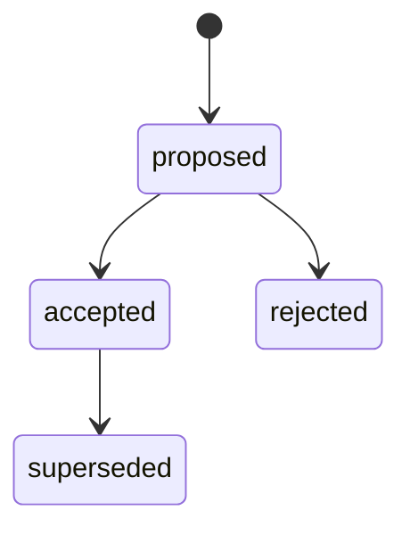
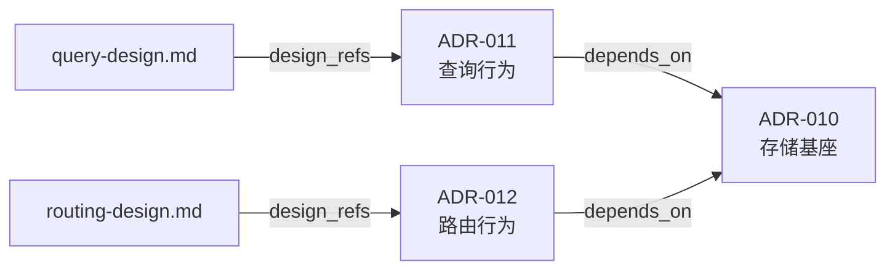
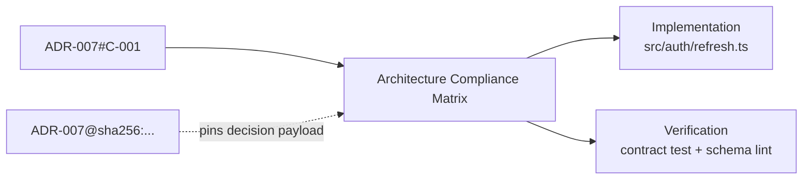

# ADR、Architecture Decision Gate 与 Compliance

## 目标

ADR 保存一个长期有效、具有架构意义的决定。它解释问题、决策驱动因素、可信选项、选择理由、后果和确认方式。

ADR 位于稳定路径：

```text
docs/adr/adr-NNN_slug.md
```

路径不随状态移动。`docs/DECISIONS.md` 是可重建索引。

新 ADR 只写入 `docs/adr/`。仓库已有其他架构目录时原地注册：

```bash
python3 <engineering-execution-plan-dir>/scripts/epctl.py --repo . \
  register-architecture-root docs/design-docs
```

配置保存在 `docs/.epctl/config.json`。注册目录必须位于仓库 `docs/` 下；
绝对路径、路径穿越和 symlink escape 会被拒绝。

## 何时需要 ADR

当存在两个以上可信选项，并至少满足一项时创建 ADR：

- 影响公共 API、事件、schema、配置或兼容协议。
- 跨模块、服务或团队边界。
- 形成长期技术约束。
- 迁移或逆转成本较高。
- 涉及安全、数据一致性、可靠性或部署拓扑。

局部实现细节、执行顺序和容易逆转的策略写入 ExecPlan Decision Log。没有需要独立
决定的架构级选择时，ExecPlan 必须写明 `architecture_decision_gate: not_required`
的具体理由；这不等于现有架构不适用，Architecture Compliance 仍需单独判断。

## 必需内容

- Context and Problem Statement
- Decision Drivers
- Research Evidence
- Considered Options
- Decision Outcome
- Decision Statement
- Normative Constraints
- Consequences
- Confirmation
- Revisit Triggers
- More Information
- Revision Notes

Research Evidence 应复述 sealed Synthesis 的决策级结论并提供路径。ADR 读者不需要重建全部 Research。

## 状态



- `proposed`：可由 Agent 起草和修订。
- `accepted`：明确 Decision Owner 批准，成为当前架构约束。
- `rejected`：明确 Decision Owner 拒绝，保留原因。
- `superseded`：被新的 accepted ADR 替代。

只有 proposed ADR 可以执行 `decide-adr`。命令要求 `--decision-maker`；skill 还要求本轮对话存在用户或 Decision Owner 的明确授权。脚本记录授权主体，不能推断授权。

accepted 和 rejected schema 1.1/1.2/1.3 ADR 的正文、Research/ADR/Design 输入、
`decision_maker` 与 `decided` 一起进入 SHA-256。决定后修改这些内容会使
`validate` 失败。生命周期元数据可以增加 supersession 链，但决策内容保持不变。

## 可执行的规范约束

新 ADR 使用 schema 1.3。`Decision Statement` 用一句话说明被接受或拒绝的完整
决定；`Normative Constraints` 把它拆成下游可引用的稳定约束：

Schema 1.3 还实现 Artifact Metadata Contract：`metadata_schema`、
`artifact_type`、stable `id`、`title`、`status`、`author`、`owner`、`created`、
`updated` 都进入决定 payload。`author`/`owner` 不能替代
`decision_maker`；决定后修改 attribution 会触发 digest drift。

| ID | Strength | Scope | Constraint | Confirmation |
|---|---|---|---|---|
| `C-001` | `must` | `gateway → token service` | 刷新请求必须携带 stable subject ID | contract test `refresh_subject_id` |
| `C-002` | `must_not` | `public refresh response` | 不得返回 provider refresh token | schema/lint rule `no_provider_token` |

- ID 在同一 ADR 内稳定，允许 `must`、`must_not`、`should`、`may`。
- EP 使用 `ADR-007#C-001` 形式引用，不复制一个没有身份的散文句子。
- Confirmation 必须落到 test、lint、schema check、CI evidence 或可观察人工验收。
- ADR 正文是规范源；Design Doc 解释结构和流程，不能静默新增或覆盖约束。

## 原子决定与有类型关系

一份 ADR 只回答一个可独立接受、拒绝、修订或替代的问题。一个功能需要多个架构
决定时，保留多份 ADR，并用 schema 1.2/1.3 的关系字段连接：

| 字段 | 语义 | 对旧 ADR 状态的影响 |
|---|---|---|
| `depends_on` | 当前决定成立所需的 accepted 前置决定 | 无 |
| `amends` | 当前决定缩小、扩展或改写旧决定的局部范围 | 两份都保持 accepted |
| `amends_constraints` | 被局部修改的稳定 `ADR-NNN#C-NNN` 集合 | 每个 `amends` ADR 至少对应一项 |
| `supersedes` | 当前决定完整替代旧决定 | 旧决定变为 superseded |
| `design_refs` | 解释接口、数据流、迁移或运维细节的 Design Docs | 无 |

`depends_on`、`amends`、`supersedes` 必须互斥、不能指向自身；
`depends_on` / `amends` 图必须无环。不要从无类型的 `relates_to` 猜测依赖，
迁移时由架构 Owner 显式补充关系。



创建严格 ADR 的示例：

```bash
python3 <engineering-execution-plan-dir>/scripts/epctl.py --repo . new-adr \
  --slug spans-routing \
  --title "Choose spans routing behavior" \
  --research R-004 \
  --depends-on ADR-010 \
  --amends ADR-008 \
  --amends-constraint ADR-008#C-002 \
  --design docs/design-docs/spans-env-placement-routing.md
```

`amends` 适用于旧决定总体仍成立、只有明确局部被修改的情况。若新旧约束不能同时
成立，必须使用 supersession，不能用 `amends` 回避旧 ADR 失效。schema 1.2/1.3 不允许
只写 `amends: ["ADR-008"]` 而不说明约束；旧 ADR 没有结构化 constraint 时，应新建
可审计的 replacement ADR，而不是猜测旧文档中的局部范围。

## Supersession

架构决定发生变化时：

1. 创建新的 proposed ADR，引用新 Research。
2. 完整说明旧决定为何不再满足 Decision Drivers。
3. 获得明确授权并接受新 ADR。
4. 运行 `supersede-adr ADR-OLD --by ADR-NEW`。
5. 更新受影响的 active ExecPlan。

新 ADR 必须为 accepted。旧 ADR 变为 superseded 并填写 `superseded_by`；新 ADR 的 `supersedes` 增加旧 ID。active ExecPlan 引用 superseded ADR 时验证失败，直到引用和执行约束同步更新。

## 既有 ADR 与 Design Doc corpus

注册 root 后，验证器发现两类 ADR：

- 严格 ADR：schema 1 / 1.1 / 1.2 / 1.3，具有稳定 ID、必需 section、显式 Decision Owner
  和决定后 seal。
- linked legacy ADR：`doc_type: adr`，或文件名包含 `ADR-NNN`，并具有可识别
  status。

accepted legacy ADR 可以兼容作为 Architecture Input，但会告警其缺少 epctl
决策权记录和 seal。它是历史事实的只读接入，不代表 Agent 有权补签或改写。
后续方向变化时创建严格的新 ADR；legacy ADR 没有稳定 constraint IDs 时使用
`supersedes`，不要伪造 `amends_constraints`。

Design Doc 是架构输入，不是决策授权。`doc_type: design` 的 `draft` 文档可以在
实施中被引用，但会告警；`obsolete`、`abandoned`、`superseded`、`rejected`
文档不能作为输入。不要 hash 整个持续变化的 design-docs 目录；只引用本 EP
需要的文件，最终完成由代码 revision、CI evidence 与 EP archive seal 证明。

当前 Design Doc 使用 `metadata_schema: "1"`、`artifact_type: design-doc` 和在仓库
内唯一的 `DD-NNN`，并携带 title/status、author/owner、created/updated。注册 corpus
后 `validate` 会检查这些字段和 ID 冲突。缺少该层的既有 Design Doc 继续只读兼容
并告警；当作者本来就在实质修订它时再迁移，不为补 metadata 改写 sealed ADR。

## Decision Gate、Compliance 与 Input Set

EP v2.6+ 把两个过去容易混在一起的问题拆开：

| 问题 | 字段 | 允许状态 |
|---|---|---|
| 本次路线是否需要一个独立架构决定？ | `architecture_decision_gate` | `satisfied` / `not_required` |
| 哪些已有架构约束适用于本次实施？ | `architecture_compliance` | `applicable` / `not_applicable` |

Decision Gate 为 `satisfied` 时必须引用 accepted ADR；为 `not_required` 时必须记录
理由，但仍可引用适用的既有 ADR。Compliance 为 `applicable` 时必须有 ADR、Design
Doc 或架构入口；为 `not_applicable` 时必须无 architecture inputs 并记录理由。
proposed、rejected 和 superseded ADR 都不能作为 active EP 的 current input。

Compliance applicable 时，输入集合由以下内容组成：

- `adr_refs`：直接需要的 ADR 以及 `depends_on` / `amends` 传递闭包。
- `design_refs`：EP 直接需要的 Design Docs，以及 ADR 声明的全部 Design Docs。
- `architecture_entrypoint`：可选的架构索引或概览页。
- `adr_constraint_refs`：所有 schema 1.2/1.3 ADR constraints 的精确集合。
- `adr_evidence`：每份 sealed ADR 的 `ADR-NNN@sha256:<payload>` 摘要。

缺少依赖闭包、漏掉命中约束的 current scoped amendment、出现重复 ADR ID、关系
循环、引用不存在或 Design Doc 已废弃时，`new-ep` / `validate` 都失败。
`architecture_entrypoint` 只负责导航，不替代 ADR；Design Docs 可以在“不需要新
决定”的 EP 中作为解释输入，但不能提供 Decision Owner 授权或覆盖 ADR。



active EP 必须跟随 current accepted ADR。completed/cancelled EP 则保存完成或取消时的
ADR digest；决定后来 superseded 不会抹掉历史计划的证据，也不要求改写归档正文。

ExecPlan 必须在 `Research and Architecture Inputs` 中复述：

- 选择的架构方向。
- 对模块、接口、数据和部署的约束。
- 负面后果与迁移义务。
- ADR Confirmation 如何进入测试、lint 或验收。

并在 `Architecture Compliance Matrix` 中让每个结构化 constraint 恰好出现一次，
明确它由哪里实现或保持、怎样被验证。引用提供审计链；矩阵把规范变成执行契约。

引用提供审计链；根 ExecPlan 仍需自包含。
