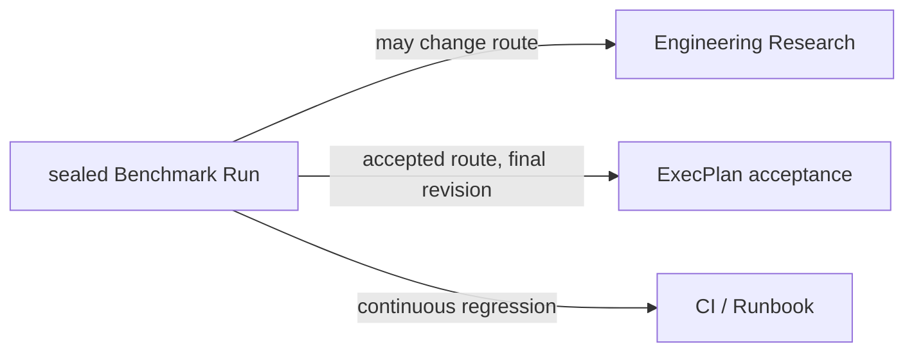
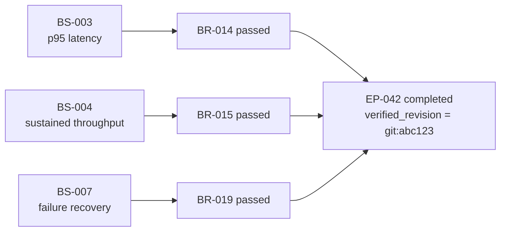
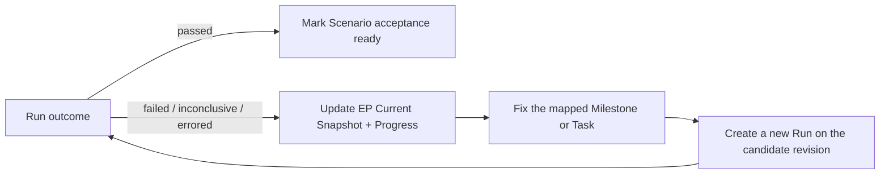

# Benchmark evidence in an ExecPlan

## Routing

Benchmark evidence has three different routes:



Do not add every Benchmark to Research. Use Research when the evidence must be
combined with other sources, contradicts prior assumptions, or may change the
architecture route. Use direct ExecPlan evidence only after the route and
acceptance rule are fixed.

## Direct evidence reference

A completed ExecPlan may use:

```text
benchmark:BR-014@sha256:<evidence-manifest-payload-sha256>
```

The referenced Run must exist locally below `benchmarks/suites/` and contain
`RESULT.md`, `SCENARIO.md`, `EVIDENCE_MANIFEST.json`, and an `artifacts/`
directory. The consumer does not import or invoke the producer Skill.

For a `benchmark:` reference, `epctl archive-ep` and `epctl validate` require:

- Manifest schema `"1"`, status `sealed`, and the referenced Run ID;
- outcome `passed`;
- reference digest equal to `payload_sha256`;
- a valid canonical Manifest payload digest;
- an exact local inventory of Result, Scenario snapshot, and artifacts;
- matching byte counts and SHA-256 values;
- Result identity, status, outcome, completion, and executor matching Manifest;
- Result `subject_revision` equal to ExecPlan `verified_revision`;
- no symlinked or out-of-bundle evidence.

This proves which revision passed which predeclared protocol. It does not prove
that the Scenario was the right business or architecture criterion; that comes
from the accepted ADR and the ExecPlan's Validation and Acceptance section.

## Multiple Scenario gate

ExecPlan v2.5 declares its full Benchmark acceptance boundary before
implementation:

```yaml
required_benchmark_scenarios: ["BS-003", "BS-004", "BS-007"]
```

Create it by repeating the option:

```bash
python3 <skill-dir>/scripts/epctl.py --repo . new-ep \
  --slug implement-placement \
  --title "Implement spans placement" \
  --research R-006 \
  --adr ADR-011 \
  --benchmark-scenario BS-003 \
  --benchmark-scenario BS-004 \
  --benchmark-scenario BS-007
```

Each Scenario is an independent gate. For example, latency, throughput, and
recovery can all drive one EP without being collapsed into one score:



For a completed v2.5 EP, the accepted `benchmark:` references must form an
exact one-to-one cover of the declared Scenario set:

- every required Scenario has exactly one valid passed sealed Run;
- no accepted Benchmark Run belongs to an undeclared Scenario;
- every Run has `subject_revision` equal to the same EP
  `verified_revision`;
- generic `ci:` and `artifact:` evidence may still be attached in addition.

Missing one Scenario, attaching two accepted Runs for one Scenario, or combining
Runs from different revisions block archival. A failed or inconclusive Run is
preserved as evidence and should drive more development, but it cannot satisfy
the completion gate.



The loop does not automatically create code changes. The EP remains the owner
of scope, task decomposition, and next action; Benchmark provides the measured
feedback. Preserve every negative Run and never lower a threshold after seeing
it merely to make the gate pass.

## Archive example

```bash
python3 <skill-dir>/scripts/epctl.py --repo . archive-ep EP-042 \
  --verified-revision "git:<verified-commit>" \
  --evidence "benchmark:BR-014@sha256:<manifest-payload-sha256>" \
  --evidence "benchmark:BR-015@sha256:<manifest-payload-sha256>" \
  --evidence "benchmark:BR-019@sha256:<manifest-payload-sha256>"
```

Generic `ci:` or `artifact:` evidence remains valid and keeps its existing
meaning. Use `benchmark:` only when the versioned local bundle is present and
should be verified mechanically.

## Drift and correction

Any later change to a sealed Result, Scenario snapshot, or artifact invalidates
both Benchmark validation and the completed ExecPlan that cites it.

Never repair a cited bundle in place. Create a new Run, seal it, and use a new
ExecPlan or an explicitly governed follow-up to record the new evidence.
