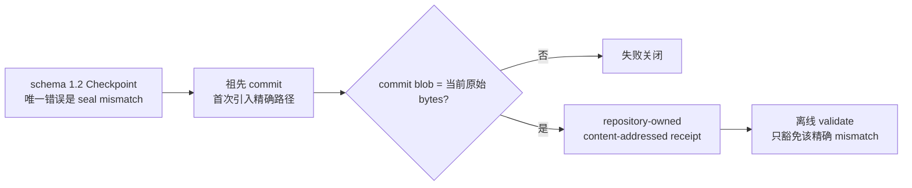

# Checkpoint 与有界工作集

## 核心模型

`EXECPLAN.md` 是当前工作集，不是无限增长的审计日志。它必须让无历史会话的 Agent 直接继续，但不需要内联所有旧事件。

```text
ep-NNN_slug/
├── EXECPLAN.md
├── tasks/
├── history/
│   ├── cp-001_milestone-one.md
│   └── cp-002_milestone-two.md
└── artifacts/
    ├── validation-001.txt
    └── trace-001.json
```

- `EXECPLAN.md`：当前目的、系统事实、当前里程碑、下一动作、未完成验收、开放 blocker 和当前接口。
- `history/`：已经封存的不可变事件原文。checkpoint 形成单向链。
- `artifacts/`：完整日志、trace、截图、视频和生成物。根文档只保留结论与路径。

“只追加”是逻辑不变量：历史事件一旦记录不能被改写。它们可以从根文件无损搬到 sealed checkpoint，不能被删除或只留下无法追溯的摘要。

## 何时建立 Checkpoint

规模信号采用两级阈值：

| 指标 | `checkpoint_recommended` | `checkpoint_required` |
|---|---:|---:|
| 根文档 | 超过 500 行 | 超过 800 行 |
| 根文档 bytes | 超过 48 KiB | 超过 64 KiB |
| 活跃历史事件 | 超过 30 条 | 超过 50 条 |

以下停止点也应建立 checkpoint：

- 一个可独立验证的里程碑完成。
- 准备跨会话交接或长时间暂停。
- 大量已解决 blocker、发现和决策开始遮蔽当前下一步。

这些信号不是完成条件。`validate` 只发 warning，不自动修改计划；`status` 在
`working_set` 输出 `bounded`、`checkpoint_recommended` 或
`checkpoint_required`。

Checkpoint 只压缩历史。如果 checkpoint 后根文件仍超过目标值，先把接口细节、
完整输出和长期设计分别移到 Design Doc 或 `artifacts/`。如果剩余工作包含多个可
独立验证、发布或回滚的结果，创建 successor EP。反复 checkpoint 不能修复范围
过宽。

## Checkpoint 前置条件

执行前：

1. 把仍然有效的发现和决策吸收到 Context、Constraints、Plan、Interfaces 和 Validation。
2. 更新 `Current Snapshot` 的当前状态与准确下一动作。
3. 把完整验证输出写入 `artifacts/`，根文档只保留短结论和路径。
4. 确认每条 Progress 使用 `[x]` / `[ ]` 表达完成状态。
5. 确认 blocker 使用 `open` / `resolved` / `dismissed`。
6. 删除所有 `<!-- REQUIRED... -->` 占位符并运行 `validate`。
7. 取得当前 repository/workspace revision；Git 可使用 `git:<sha>`，其他
   VCS 或构建系统使用稳定的 `snapshot:<id>`。

语义摘要由 Agent 编写，脚本不自动推断关键决策。

## 命令

先预览：

```bash
python3 <skill-dir>/scripts/epctl.py --repo . checkpoint EP-023 \
  --slug milestone-one \
  --title "Milestone 1 complete" \
  --current-milestone "Milestone 2: adapter integration" \
  --summary "契约层已完成；适配层仍待实现。" \
  --next-action "编辑 src/adapter.ts 并运行 npm test。" \
  --revision "git:<current-commit>" \
  --dry-run
```

确认预览后去掉 `--dry-run`。命令会：

- 封存已勾选 Progress。
- 封存 Surprises & Discoveries 与 Decision Log，并将根 section 重置为 checkpoint 后的新事件区。
- 只封存 `resolved` / `dismissed` blocker，保留 `open` blocker。
- 封存 Revision Notes。
- 更新 `Current Snapshot`、`latest_checkpoint` 和索引更新时间。
- 记录 `repository_revision`，说明历史对应的代码或工作区版本。
- 创建 schema 1.2 Checkpoint，继承父 EP 的 author/owner，并记录
  `metadata_schema: "1"`、`artifact_type: checkpoint` 和 `generated_by`。
- 为包含 frontmatter metadata 与正文的 canonical checkpoint payload 写入
  SHA-256；后续修改 attribution、revision 或正文都会使 `validate` 失败。

旧 schema 1/1.1 Checkpoint 按原 body-only digest 保持兼容，不为补 metadata
改写已封存历史。

## 永远留在根文档的内容

- 当前 Purpose、Context、Constraints、Plan 和接口。
- 当前 `Current Snapshot` 与下一动作。
- 所有未完成 Validation and Acceptance。
- 所有未勾选 Progress。
- 所有 open blocker。
- 当前 Recovery 方法。

checkpoint 不能成为恢复工作的必读前置。只有调查历史原因或审计旧证据时才读取 `history/`。

## 迁移与恢复

旧 v2.0 ExecPlan 没有 `schema_version: "2.1"`、`latest_checkpoint` 或 `Current Snapshot`。不要静默压缩它：

1. 在 front matter 增加 `schema_version: "2.1"` 和空的 `latest_checkpoint:`。
2. 增加 `## Current Snapshot`，写当前里程碑、当前状态和下一动作。
3. 运行 `validate`，再建立第一个 checkpoint。

`checkpoint` 使用仓库锁、编号高水位和原子文件替换。普通失败会回滚根文档和索引；若进程在索引更新前崩溃，制品仍是事实源，运行 `validate --fix-index` 恢复投影。

## 出生即错误的 seal 恢复

历史 Checkpoint 不能因为早期 producer 写错 `payload_sha256` 就被就地修补。只有
Git 历史能够证明错误 bytes 在该精确 checkpoint 路径首次出现时就已存在，才可
登记外部恢复凭据：



先预览，再应用：

```bash
python3 <skill-dir>/scripts/epctl.py --repo . \
  register-checkpoint-recovery EP-023 CP-001 \
  --from-git-commit <full-ancestor-commit> \
  --attested-by "<explicit actor>" \
  --reason "<why this seal was invalid at introduction>"

# 审查 plan/checkpoint、stored/computed digest、commit/blob/path 和目标后：
python3 <skill-dir>/scripts/epctl.py --repo . \
  register-checkpoint-recovery EP-023 CP-001 \
  --from-git-commit <full-ancestor-commit> \
  --attested-by "<explicit actor>" \
  --reason "<why this seal was invalid at introduction>" --apply
```

默认使用 checkpoint 当前路径；若计划已经从 `active` 归档到 `completed`，可用
`--git-path` 指向 introduction commit 中的历史仓库相对路径。receipt 写入
`docs/.epctl/checkpoint-recoveries/EP-NNN/CP-NNN/sha256-<document>.json`，记录原始
document SHA-256、错误/正确 payload digest、Git commit/blob/path/commit time、
attesting actor、reason 与自身 digest。Git 只在登记时读取；clone、源码包和无 `.git` snapshot
的正常验证只消费仓库内 receipt。

以下情况一律不能恢复：schema 不是 1.2、还有其他结构错误、commit 不是 `HEAD`
祖先、任一父 commit 已含该路径、Git bytes 与当前 bytes 不同、receipt 被改写、
或 checkpoint 后续发生任何 byte change。恢复不改变 Checkpoint bytes，也不把错误
seal 视为正确；`validate` 会保留一条明确 warning，指出使用了出生缺陷凭据。
