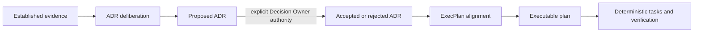
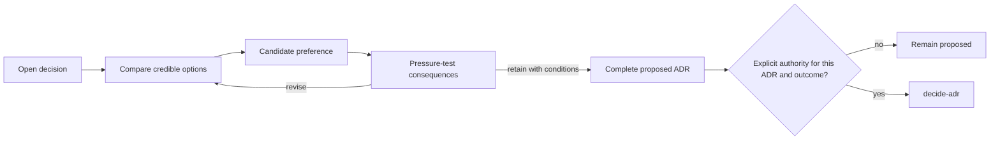

# Collaborative ADR Deliberation and ExecPlan Alignment

Use this protocol when a user wants to reason together about an architectural
decision or a materially different execution plan. It governs conversational
convergence only. It does not add artifact states, accept an ADR, approve a
Design, or prove that an ExecPlan is complete.

## Shared interaction rules

- Focus one round on one material tension. Closely coupled consequences may be
  discussed together when separating them would produce a false choice.
- Start from a concrete scenario and two or three viable shapes. State the
  current inclination, evidence, downside, and condition that would invalidate
  it. Do not hide behind a neutral list.
- Ask one primary question that lets the user alter or combine the shapes.
  Do not reduce collaboration to repeated option voting.
- Treat a terse option selection during exploration as a candidate preference.
  Restate its consequences and test one discriminating failure, migration,
  compatibility, or ownership case before treating the direction as stable.
- Do not ask the user to supply repository facts that can be inspected. Ask for
  product priorities, authority boundaries, risk tolerance, or external
  coordination constraints that only the user can decide.

## Deliberate an ADR

ADR deliberation ends in a decision proposal that an authorized actor can
accept or reject as a whole:

1. Verify that evidence is sufficient; route material factual unknowns to
   Research and unresolved system shape to Design.
2. Frame one atomic decision, its Decision Drivers, and why doing nothing is or
   is not viable.
3. Compare credible options against the drivers and expose negative
   consequences, migration obligations, and revisit triggers.
4. After a preference appears, test one case likely to separate the options.
5. Write the exact Decision Statement, Normative Constraints, consequences,
   Confirmation, and outcome into a proposed ADR.
6. Summarize what accepting or rejecting that exact ADR means. Run
   `decide-adr` only when an identifiable user or Decision Owner explicitly
   authorizes the outcome for that ADR.

`2`, `Option B`, approval to continue work, or approval to implement the wider
feature is not automatically authority for a complete ADR. A statement such as
“I am the Decision Owner; accept ADR-007 with Option B” is attributable and
specific enough, provided ADR-007 already exposes the exact decision and
constraints being accepted.

## Align an ExecPlan

ExecPlan alignment assumes the architecture input set is established. It may
shape execution, but it must not create new architecture policy inside the
plan.

Material alignment dimensions include:

- user-visible completion boundary and explicit non-goals;
- milestone boundaries and dependency order;
- coexistence, migration, rollout, rollback, and cleanup;
- external coordination and ownership handoffs;
- validation evidence, Benchmark gates, and failure recovery.

Propose a concrete default plan from repository facts before asking questions.
When two credible plan shapes materially differ, compare them and pressure-test
one case such as partial rollout, rollback after an irreversible step, a failed
dependency, or unavailable acceptance evidence. Ask the user only for the
constraint that discriminates between the shapes.

After alignment, write the selected shape, alternatives, assumption, and
pressure-test outcome into the appropriate current sections and Decision Log.
Agreement to the plan does not mark Milestones, Validation, Tasks, Benchmark
gates, or archive evidence complete.

If discussion changes a public interface, data ownership, security boundary,
reliability contract, or other long-lived architecture constraint, stop EP
alignment. Route the issue to Research, Design, or a proposed ADR, then resume
the plan after the architecture input is current.

## Keep deterministic phases deterministic

| Phase | Rule |
|---|---|
| Routine Task decomposition | Infer bounded changes and validation; ask only when scope or human ownership is materially missing. |
| Checkpoint | Seal observed history and current revision; do not negotiate evidence. |
| Benchmark Run | Apply its predeclared Scenario; failed or errored evidence stays truthful. |
| Validation | Execute the stated checks and record observable results. |
| Archive | Require all mechanical gates and real evidence; verbal agreement cannot substitute. |

When the user delegates planning rather than requesting collaboration, choose a
safe concrete plan, state material assumptions and downsides, and proceed. Do
not manufacture interaction where the plan is already determined.
