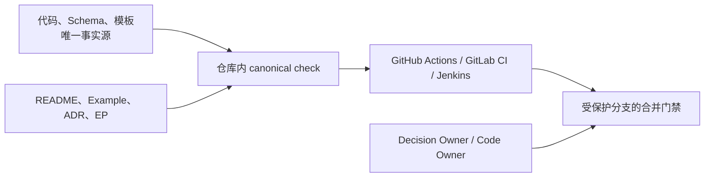

# 文档与代码完整性

CI 是执行器，不是事实源。把真正的保证放进仓库内的确定性命令，再让任意 CI
平台调用同一个入口并在合并策略中要求它成功。



## 三类文档

- 生成投影：索引、manifest、命令参考。由工具生成或用 regeneration-diff
  验证，不手抄哈希、字节数和派生状态。
- 当前规范：架构边界、公开契约和用户行为。把重要约束编码为测试、lint、
  schema check 或可观察验收。
- 历史制品：concluded Research、accepted/rejected ADR、Checkpoint 和
  completed EP。封存而不是追随 HEAD 重写；新方向通过 superseding ADR 和新
  ExecPlan 表达。

当前 governed artifacts 还必须携带 Artifact Metadata Contract 的 stable ID、
type、title/status、author/owner 和 created/updated。Raw/binary evidence 由 manifest
携带等价 metadata 与 SHA-256。源代码、普通配置和生成索引不添加装饰性 author
header；它们依赖 Git、CODEOWNERS、generator provenance 和 canonical source。

## Canonical check

每个代码仓库只提供一个本地入口，例如 `make check`、`./scripts/check` 或
`python3 scripts/check.py`。它至少执行：

1. 项目测试、架构测试和 lint。
2. `researchctl validate` 与 `epctl validate`。
3. 本地 Markdown 链接与引用完整性。
4. Example/fixture 端到端 contract test。
5. 生成投影重建后无 diff。

开发者、本地 Agent 和所有 CI 平台调用同一个入口。不要在 CI YAML 中重新拼装
测试清单，也不要用 path filter 跳过文档-only 或代码-only 变更。

## ADR 和实现约束

accepted ADR 的 `Confirmation` 必须列出持续确认方式。优先级依次是：

1. 自动测试或结构 lint；
2. schema/API contract test；
3. 可重复的端到端观察；
4. 无法自动化时的 Decision Owner 人工验收。

“修改代码就必须修改文档”不是可靠规则，会诱导无意义改动。应检查具体不变量，
并在架构敏感目录上配置 Code Owner。

## Revision 与完成证明

Checkpoint 使用 `--revision` 记录它封存的 repository/workspace 版本。可以是
`git:<sha>`、其他 VCS revision，或稳定的 `snapshot:<id>`；它不绑定 GitHub。

完成 v2.3+ ExecPlan 时，使用：

```bash
python3 <skill-dir>/scripts/epctl.py --repo . archive-ep EP-001 \
  --outcome completed \
  --verified-revision "git:<verified-commit>" \
  --evidence "ci:<pipeline-or-job-url>" \
  --evidence "artifact:docs/exec-plans/active/ep-001_name/artifacts/final.txt"
```

`verified_revision` 表示实际运行验收的版本，不必等于后续只移动/封存文档的提交。
`archive_sha256` 封存归档后的 frontmatter（包括 metadata）和正文，防止
attribution、revision/evidence 被
事后改写。CI 应在包含归档变更的最终 revision 上再次运行 canonical check。

## 平台适配

| 平台 | 薄适配器 | 合并侧强制 |
|---|---|---|
| GitHub | `.github/workflows/*.yml` | Ruleset/branch protection 要求稳定的 status check |
| GitLab | `.gitlab-ci.yml` | Protected branch + Pipelines must succeed |
| 其他 | 对应 pipeline 文件 | 禁止绕过 canonical check 的直接合并 |

CI 文件只负责选择运行时并调用 canonical check。审批人和 bypass 策略属于仓库
治理配置，不属于 Skill 或某个 Agent 的安装契约。GitLab Free 的 CODEOWNERS
可以路由 review；强制 Code Owner approval 取决于 GitLab tier。无论是否具备
该审批能力，都应保护默认分支并要求 pipeline 成功。

## 周期性清理

PR/MR CI 负责阻止新漂移；scheduled pipeline 负责发现外部依赖、真实 corpus、
失效链接和长期未验证文档的慢性漂移。定时任务应报告或创建修复工作，不得静默
改写 sealed 历史制品。
