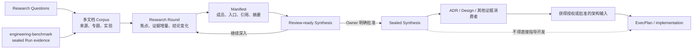

# Engineering Research

把决策相关未知转化为可审计、可多轮深化的多文档证据包。输出有界的
Synthesis；只有 Research Owner 明确授权后才封存并交给 ADR 或 Design。
Research 只建立事实、证据、置信边界与候选建议；未被 ADR 或 Design 显式转化的
内容仍只是调研，不得作为 ExecPlan、Task 或代码修改的开发指令。



Research 是“身份与生命周期 + 文档集合 + Synthesis”，不是某个固定文件名。
控制包中的 `RESEARCH.md` 只维护目的、问题、当前路线、发现索引和下一步。

风险自适应路由中，Explore 可以在线程内调查和做一次性实验，Build 可以补齐有界
实现事实；两者不因任务复杂度自动创建 Research。只有进入 Governed 且存在会改变
长期路线、公共边界、安全、数据、可靠性或不可逆操作的未知，或用户明确要求持久
Research 时，才使用本 Skill。所有模式都保留真实来源与不确定性，不得用轻模式绕过
已确认的硬边界。

## 判断边界

以下情况使用一个 Research ID 和多篇文档：

- 文档服务于同一个决策目的；
- Research Questions 需要一起排序选项；
- 文档共享结论时间和下游 Synthesis；
- `index.md`、专题分析、能力矩阵、实验报告只是同一证据图的不同入口。
- 第一版后继续深入、复核某个点或补实验时，创建新 Round，不创建新
  Research ID。

以下情况拆成多个 Research ID：

- 决策目的、Owner、结束时间或下游消费者独立；
- 一个主题可以 concluded，另一个仍需长期等待；
- 一个结论可以被多个无关 ADR 或计划单独复用。

执行 Research 前读取 `references/research.md`。注册 existing corpus、修改
manifest 或处理归档完整性前再读取 `references/manifest.md`。
创建或评审结构化专题文档前读取 `references/topic.md`。

## 交互式研究引导

用户要求一起研究、讨论某个研究点，或现有证据暴露多个会改变下游决定的调查分支
时，完整读取 [collaboration.md](references/collaboration.md)。交互只校准问题、
优先级、适用场景和下一步证据，不通过偏好投票决定事实。

- 先报告当前发现、置信度、矛盾和真正的证据缺口，再给出 2–3 个有区分力的下一步
  调查方向及其决策影响；说明推荐顺序，只问一个主要方向问题。
- 用户的简短选择可以改变当前 Round 的 focus，但不能自动把 `RQ-NNN` 标为
  `answered`、把假设写成结论或触发 `conclude-research`。
- 当用户纠正研究意图时，区分误解与新 inquiry，按当前 Round、
  `amend-current-round` 或 `new-round` 的既有规则处理；不要为每个聊天回合建 Round。
- 证据与用户偏好冲突时保留矛盾。Research 可以推荐带条件的方案，但架构接受属于
  下游 authority，Research 结束仍需 Owner 明确授权。

## 仓库制品

```text
docs/research/
├── active/r-NNN_slug/
│   ├── RESEARCH.md
│   ├── RESEARCH_MANIFEST.json
│   ├── SYNTHESIS.md
│   ├── rounds/
│   ├── notes/
│   │   └── README.md       # 必需的阅读入口；导航专题与其他 managed 分析
│   ├── snapshots/
│   └── artifacts/
└── completed/
```

- **managed corpus**：研究文档位于控制包内，通常写入 `notes/`。
- **notes 导航**：当前 schema 的 active package 必须把 `notes/README.md` 登记为
  manifest entrypoint。它只组织阅读路线；当前结论与下游交接仍以
  `SYNTHESIS.md` 为准。
- **linked corpus**：研究文档已存在于仓库其他位置；active 阶段只登记，不移动。
- linked Research concluded 时，把声明的文档复制到
  `artifacts/research-snapshot/`，再封存 manifest 和 Synthesis。
- 原始二进制、日志、trace、benchmark 数据仍走 `artifacts/`，不会因文档
  manifest 自动复制。
- 需要稳定 Scenario、重复执行、原始 artifacts 与封存摘要的测量，使用独立
  `engineering-benchmark` 生成 sealed Run；Research 只引用并解释其证据。
- `SYNTHESIS.md` 是当前累积认识；`mark-review-ready` 默认只递增 revision
  并写入正文摘要，不复制文件。正式评审、对外交接或重大决策时追加
  `--snapshot`，在 `snapshots/` 保存去重后的全量里程碑。
- snapshot revision 允许稀疏；相同 Synthesis 正文复用已有文件。conclude
  会在封存前确保最新唯一正文至少有一份全量快照。

## 优先使用 researchctl

把 `<skill-dir>` 解析为本 skill 所在目录。命令都在目标代码仓库根目录运行：

```bash
python3 <skill-dir>/scripts/researchctl.py --repo . init

python3 <skill-dir>/scripts/researchctl.py --repo . new-research \
  --slug cache-topology --title "Research cache topology" \
  --owner "Cache Platform Owner" --author "Codex" \
  --research-type technical

python3 <skill-dir>/scripts/researchctl.py --repo . new-research \
  --slug spans-aggregate --title "Research spans aggregate" \
  --owner "Observability Owner" --author "Codex" \
  --corpus-root _bmad-output/planning-artifacts/research/spans-aggregate \
  --entrypoint _bmad-output/planning-artifacts/research/spans-aggregate/index.md

python3 <skill-dir>/scripts/researchctl.py --repo . sync-research R-001
python3 <skill-dir>/scripts/researchctl.py --repo . validate
python3 <skill-dir>/scripts/researchctl.py --repo . status

python3 <skill-dir>/scripts/researchctl.py --repo . new-topic R-001 \
  --slug http-security --title "HTTP security boundary" \
  --question RQ-002 --author "Security Researcher"

python3 <skill-dir>/scripts/researchctl.py --repo . amend-current-round R-001 \
  --reason "Owner rejected the interpreted scope before milestone handoff"

python3 <skill-dir>/scripts/researchctl.py --repo . mark-review-ready R-001
python3 <skill-dir>/scripts/researchctl.py --repo . \
  mark-review-ready R-001 --snapshot
python3 <skill-dir>/scripts/researchctl.py --repo . new-round R-001 \
  --slug http-security --title "Deep dive into HTTP security"

python3 <skill-dir>/scripts/researchctl.py --repo . conclude-research R-001 \
  --approved-by "Cache Platform Owner" \
  --approval-ref "thread:<message-or-review-reference>"
```

`new-research` 可以重复提供 `--corpus-root`、`--entrypoint` 和 `--include`。
绝对输入路径只有在解析后仍位于目标仓库内才接受；manifest 永远保存仓库相对路径。
新建 Research 会生成 `notes/README.md`。`sync-research` 会为旧的 active
schema 1 或 1.1 package 补齐缺失入口，并只更新带完整 `RCTL:NOTES` marker 的自动目录；
没有 marker 的人工导航保持原字节不变，未链接文档仅报告 warning。

## 工作流程

1. 先检查仓库代码、测试、已有文档和权威外部来源。
2. 创建 Research，写清 Purpose、Scope、Decision Drivers 和所有 `RQ-NNN`。
   `owner`、`author` 和 `research_type` 必须真实；未知就保留未分配，禁止杜撰。
3. 若用户要求共同探索或多个证据分支会改变下游决定，按
   `references/collaboration.md` 校准 Research Questions、当前 Round focus、停止条件
   和下一步证据；不要询问可自行检索的事实。
4. 用 Round 组织每次有界研究迭代；用 `new-topic` 创建关联 `RQ-NNN` 的
   structured topic，其他 managed 分析写到 `notes/`，existing corpus 用 linked
   模式登记。新 Topic 使用 schema 2.3，并自动获得 Research 内唯一且不可复用的
   `RT-NNN`：首屏给答案、置信度、适用边界和决策影响；正文先建立心智模型，
   再用连续分析帮助读者理解；证据索引放到 Handoff 之后供评审追溯。
5. 保留 Topic 的 `RT-NNN`，改标题或移动文件时不得重编号。跨文档引用写成
   `R-NNN/RT-NNN/A-NNN`；Topic 内部可使用短编号。每个推理单元使用一个
   `A-NNN` 小节，标题先写可读主张、编号放末尾。正文用
   连续 prose、例子、反例、表格或 Mermaid 展开机制，并就近引用 `E-NNN`；
   `E-NNN` 在审计索引映射到 `S-NNN` 来源。单独记录哪些新证据会改变判断。
   每个关键主张保留可定位来源或可复现实验，并区分 Observation 与
   Interpretation。可复用或需要审计的实验使用 `engineering-benchmark`，在
   Research 中记录 `BR-NNN` 与 Manifest payload SHA-256。
6. 每次新增、删除、移动研究文档后更新 `notes/README.md` 的阅读路线并运行
   `sync-research`。工具生成的 README 会自动维护目录；人工 README 由作者维护。
7. 修复 manifest drift、缺失本地引用和不可解释的冲突；绝对来源路径至少记录
   可移植替代或 provenance。
8. 在 `SYNTHESIS.md` 直接回答研究目的，比较选项，保留负面证据、置信边界、
   剩余未知、推荐条件和待 ADR/Design 转化的候选影响。不要把它们写成已生效的
   实施约束。
9. 没有 open Research Question、open blocker 或 REQUIRED 标记时，执行
   `mark-review-ready`。普通轮次不加 `--snapshot`；正式评审、下游交接或重大
   决策节点才加。两者都不是结束授权。
10. 区分“纠正误解”和“继续研究”：用户明确否定当前未封存结果，说明它不是自己
   要研究的内容时，若当前 review 没有 milestone snapshot，使用
   `amend-current-round` 原地重开当前 Round，撤掉错误专题并修正 Synthesis；不要
   为 Agent 的误解创建新 Round。若当前 Round 仍为 active，直接原地编辑。
11. 用户在已认可方向上继续深入、复核或补证据时，用 `new-round`；已有 milestone
    snapshot 或下游交接时也必须新增 Round，不能改写已形成的评审边界。默认发现与
    上下文装载不读取历史快照。
12. 只有用户或声明的 Research Owner 明确说出结束、定稿、归档或 conclude，
    才执行 `conclude-research` 并记录 `approved_by` 与可审计 `approval_ref`。

## 制品元数据

新制品使用统一 `metadata_schema: "1"`：Research `1.2`、Synthesis `1.2`、
Round `1.1`、Topic `2.3`、Manifest `1.1`。它们都必须携带稳定 `artifact_type`、
`id`、`title`、`status`、`author`、`owner`、`created` 和 `updated`。

`author` 表示当前版本的实际写作者，`owner` 表示持续负责 Research 生命周期的
人或角色；两者都不能替代 `approved_by`。未知 actor 写成 `Unassigned`，不要猜测。
它允许 active 草稿存在，但不能绕过 terminal Owner gate。新 Topic 与 Round 继承
Research Owner；显式 `--author` 优先，否则继承或诚实保留未分配。当前 metadata
进入 Synthesis/Manifest 的封存边界；旧版 sealed package 保持只读，不仅为了补字段
而改写。

**禁止把“decision-ready”“问题已回答”“完成第一版”“继续”推断为结束授权。**
Research 取消同样需要 Owner 明确授权和原因。Cancelled Research 保留已获得的
证据，但不能进入下游 ADR/Design 转化与溯源 gate。

## 有界性与变更

- 根控制页只服务当前接手，不复制全部专题内容。
- `notes/README.md` 是 corpus 的阅读地图，不是第二份根控制页或 Synthesis；文档
  变多时按问题、证据类型或阅读目标组织路线，而不把正文复制进索引。
- 专题文档服务学习、决策和复核：Brief 负责导航，连续 Analysis 是正文，
  Evidence Index 是审计附录。不要用结论卡片取代推导过程；背景、方法和时间线
  仅在确实帮助理解时加入。
- Synthesis 只保存决策所需结论，不成为第二份全文。
- snapshot 始终是可独立阅读的完整 Synthesis，但只在语义里程碑创建；不要为
  每个普通 Round 留一份，也不要改成需要串联恢复的增量 patch。
- concluded 的 snapshot、manifest 和 Synthesis 不可编辑。最终授权前的新证据
  创建同一 Research 的新 Round；最终授权后的新证据创建关联的新 Research。
- Round 表达一次用户认可的问题推进，不表达每次聊天回合。对当前 active Round
  直接修订；对未生成 milestone snapshot、未交接的最新 review，可按用户明确反馈
  原地修正。被用户否定的误解性专题应从 managed corpus 撤出，版本痕迹交给 Git
  和简洁的 correction note，而不是伪装成 completed evidence。
- 如果新证据改变已接受架构方向，由下游治理工具创建 superseding ADR。
- 外部 Deep Research、BMAD 或人工文档都是 corpus 输入，不改变文件契约。

## 下游契约

本 skill 不接受 ADR，也不创建 ExecPlan。它输出：

- active Research 控制记录、Round 和 review-ready Synthesis revisions；
- manifest 中 `role: topic` 的结构化专题文档；
- active package 中作为 manifest entrypoint 的 `notes/README.md`；
- concluded Research 控制记录；
- sealed `RESEARCH_MANIFEST.json`；
- sealed `SYNTHESIS.md`；
- 可选的 snapshot、notes 和 artifacts。
- 对路线有影响的 sealed Benchmark Run 引用及其研究级解释；Benchmark Bundle
  本身仍由独立生产者维护。

下游可以为决策或设计审计读取这些制品，但不能把 Research 或 Synthesis 直接当作
实现规范。进入开发前，相关结论必须由 referenced accepted ADR 转成规范约束，或由
referenced Design 转成系统结构、接口和行为；ExecPlan 中的 `research_refs` 只保存
这条转化链的溯源证据。

消费者必须依赖该文件契约，而不是本 skill 的安装路径。完整字段、摘要算法、
引用诊断和兼容规则见 `references/manifest.md`；典型场景见
`references/examples.md`；交互式问题与证据方向校准见
`references/collaboration.md`。
