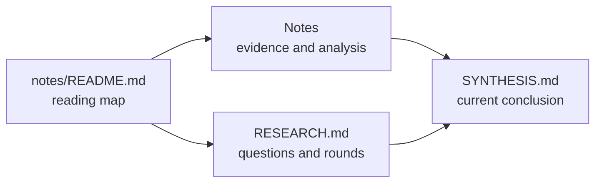

# {{ID}} Notes

This page is the reading entrypoint for the Research note corpus. Start with
{{RESEARCH_LINK}} for scope and rounds, then read {{SYNTHESIS_LINK}} for the current
conclusion and downstream handoff.

## Note inventory

<!-- RCTL:NOTES:START -->
- No note documents yet.
<!-- RCTL:NOTES:END -->

The inventory between the `RCTL:NOTES` markers is maintained by `researchctl.py`.
Content outside those markers may be edited. Remove both markers to take full manual
ownership of this page; synchronization will then preserve it and validation will
report any note documents that are not linked here.
