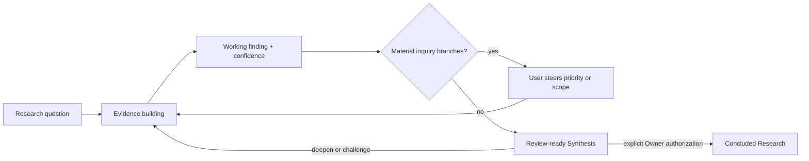

# Collaborative Research Steering

Use this protocol when the user wants to investigate together or when current
evidence leaves several inquiry branches with different downstream decision
value. Collaboration steers the questions and evidence path; it does not turn
preferences into findings.



## Interaction points

Use interaction at four bounded points:

1. **Question framing** — align the decision purpose, Research Questions,
   scope, non-goals, and what evidence would change the downstream decision.
2. **Branch selection** — when two or more evidence paths have materially
   different decision value, compare them and ask which user-owned priority or
   scenario should lead the next inquiry.
3. **Synthesis challenge** — expose confidence limits, contradictions,
   rejected hypotheses, and one counterexample before review readiness.
4. **Lifecycle authority** — only the Research Owner can explicitly conclude
   or cancel the Research.

Do not ask the user for source code facts, public documentation, or repository
state that can be discovered. Ask for the downstream decision, product context,
representative operating scenario, risk tolerance, or priority among equally
valid inquiry branches.

## Run a steering round

Keep the conversation focused on one research tension:

1. State the current working finding, evidence, confidence, and validity
   boundary.
2. Identify the exact unknown or contradiction that still changes the
   downstream choice.
3. Present two or three high-information next inquiries and what each could
   distinguish. State the recommended order.
4. Ask one primary question that lets the user revise the scenario, priority,
   or question—not vote on the factual answer.
5. Update the current Round focus and exact next inquiry after the response.

A compact response shape is:

```text
当前认识：<finding + confidence + evidence>
仍未解决：<one decision-relevant gap>
可选调查方向：<2–3 branches and what each discriminates>
我的建议：<next inquiry + reason>
想和你校准：<one user-owned priority or scenario question>
```

A terse answer such as `2` selects the next inquiry branch. It does not answer
the Research Question, validate the selected hypothesis, make the Synthesis
review-ready, or authorize conclusion. Evidence obtained in the selected
branch still determines the finding.

## Preserve evidence authority

Always separate:

- observations from sources or experiments;
- interpretation and confidence;
- the user's product priority or representative scenario;
- downstream architecture or implementation authority.

If evidence contradicts the user's preferred result, preserve the
contradiction and explain its decision impact. The user may change the product
constraint or research scope, but Research must not rewrite observations to
fit a preference.

## Map conversation to Research lifecycle

- Refine an active current Round in place while its intended inquiry remains
  the same.
- Use `amend-current-round` when the user rejects an unsnapshotted review as a
  misunderstanding of the same inquiry.
- Use `new-round` for a deeper question, new evidence, a challenge to an
  accepted direction, or any review already snapshotted or handed off.
- Do not create one Round per chat turn.
- Do not conclude because the user selected an inquiry branch, said “continue”,
  or accepted a working recommendation. Require explicit terminal authority.

When the user delegates the research rather than requesting collaboration,
choose the highest-information evidence path, state the scope and confidence
limits, and proceed without manufacturing questions.
