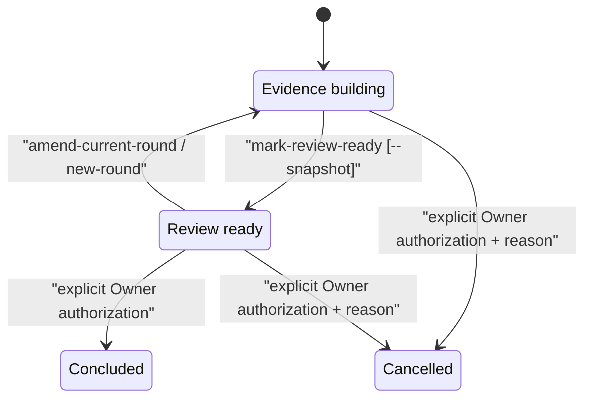
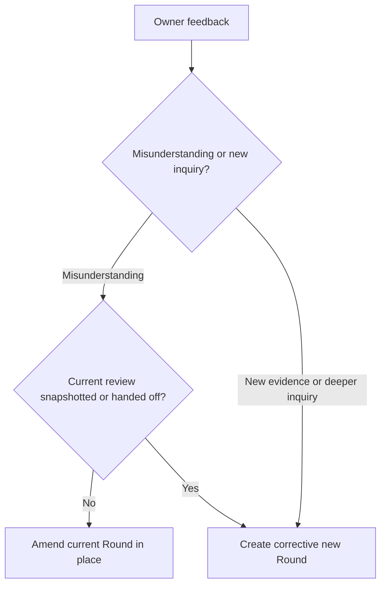

# Engineering Research workflow

## Contents

- Identity and routing
- Metadata and authority
- Research Questions
- Iterative rounds and Synthesis revisions
- Evidence and experiments
- Multi-document organization
- Synthesis
- Review, conclusion, and cancellation

## Identity and routing

Create one Research identity for one decision purpose. A Research may contain
many documents, entrypoints, discussions, experiments, and investigation
rounds. Split identities only when ownership, decision purpose, conclusion
timing, or downstream reuse is independent.

Continue under the same `R-NNN` when a user asks to deepen the first version,
challenge one finding, discuss a focused point, add sources, or rerun an
experiment for the same decision purpose. Create another `R-NNN` after a true
conclusion or when the decision purpose diverges.

Research reduces uncertainty; it does not silently make a durable architecture
decision. A Synthesis may recommend an option, while acceptance belongs to the
downstream decision authority.

## Metadata and authority

Schema 1.2 Research keeps canonical machine-readable metadata in
`RESEARCH.md` frontmatter and projects it into the visible `Research Metadata`
table. Run `sync-research` after editing metadata by hand.

| Field | Meaning |
|---|---|
| `metadata_schema` | Shared cross-artifact metadata contract; currently `"1"` |
| `artifact_type`, `id`, `title` | Portable artifact classification and stable identity |
| `research_type` | `technical`, `architecture`, `feasibility`, `comparative`, `incident`, `domain`, or `other` |
| `owner` | Human or team accountable for scope and terminal lifecycle authorization |
| `author` | Person, team, or agent that prepared the current Research |
| `status` | Lifecycle: `active`, `blocked`, `concluded`, or `cancelled` |
| `maturity` | Content maturity: `exploratory`, `evidence_building`, or `review_ready` |
| `current_round` | Current `RR-NNN` iteration |
| `synthesis_revision` | Latest content-addressed review revision; starts at `0` and is independent of physical snapshot count |
| `approved_by`, `approved_at`, `approval_ref` | Audit record for an explicitly authorized terminal transition |

Do not invent an owner, author, approval, date, or role. An unassigned Owner is
valid while active but mechanically blocks conclusion and cancellation.
`author` and `owner` are provenance and accountability; neither grants
terminal authority. Only the explicit approval event writes `approved_by`,
`approved_at`, and `approval_ref`.

`approval_ref` records where explicit authorization can be audited, such as a
task message, issue comment, review, meeting decision, or signed change
request. A CLI flag cannot create authorization: the agent may pass it only
after the user or declared Research Owner explicitly authorizes the exact
terminal transition.

## Research Questions

Use stable `RQ-NNN` rows in `RESEARCH.md`:

- `open`: evidence is still required.
- `answered`: evidence supports an answer.
- `deferred`: the question does not change the present decision and has an
  explicit future destination or trigger.
- `invalidated`: its premise is false or no longer relevant, with evidence.

Review-ready or concluded Research cannot contain open questions or open
blockers. Readiness depends on decision quality, not document count.

Starting a new round may add new questions or reopen an answered question.
Update the existing stable row instead of renumbering it.

## Iterative rounds and Synthesis revisions

A Research Round is one bounded pass over the shared decision purpose. Its
controller under `rounds/` records:

- focus and new or reopened questions;
- scope and non-goals;
- evidence added;
- change to the accumulated Synthesis;
- exact next inquiry;
- round outcome.

Round controllers index work; they do not duplicate detailed notes. One round
may reference any number of managed or linked corpus documents.

`mark-review-ready`:

1. verifies questions, blockers, placeholders, references, and manifest;
2. completes the current Round;
3. increments `synthesis_revision`;
4. content-addresses `SYNTHESIS.md` as `review_ready`;
5. with `--snapshot`, copies the complete Synthesis to
   `snapshots/synthesis-vNNN.md`;
6. leaves the Research under `active/`.

Physical snapshots are sparse milestones, not a mandatory file for every
revision. Use `--snapshot` for a formal review, downstream handoff, or material
decision boundary. It may also be added after the Research is already
`review_ready`. If an earlier snapshot has the same Synthesis body digest, the
CLI reuses it instead of creating another full copy. Snapshot filenames retain
the review revision at which that unique body was first preserved, so gaps are
valid.

`new-round` preserves existing snapshots, makes the current Synthesis editable
again, and returns maturity to `evidence_building`. Fine-grained revisions that
were not selected as milestones remain available through repository history,
not duplicate files in `snapshots/`.

### Correct a misunderstanding without inventing a new Round

A Round represents a bounded inquiry the Owner intended to pursue, not every
chat turn or every Agent attempt. Choose the lifecycle operation from the
meaning of the feedback:

| Owner feedback | Operation |
|---|---|
| “That is not what I asked; remove this direction.” while the Round is active | Edit the current Round and corpus in place. |
| The same rejection after an unsnapshotted `review_ready` result | Run `amend-current-round`, remove the unwanted corpus, and correct the same Round. |
| “Continue deeper”, “verify it”, or “add another perspective” | Start `new-round`. |
| The current review has a milestone snapshot or has been handed to a downstream consumer | Preserve it and start a corrective `new-round`. |
| Research is concluded | Never rewrite it; create a linked follow-up Research. |

`amend-current-round` retains the monotonic Synthesis revision counter, makes
the current Round active again, and returns `SYNTHESIS.md` to draft. It does
not delete files automatically: remove only the exact unwanted topics,
experiments, and references identified by the Owner, then refresh the manifest
and request review again. The next review receives the next Synthesis revision.

## Evidence and experiments

For each load-bearing claim, retain a repository path, stable authoritative
source, or reproducible experiment.

An experiment records:

- hypothesis and falsifying observation;
- working directory, command, input, and environment;
- raw observation without inference;
- interpretation and effect on option ranking;
- evidence path;
- prototype promotion, retention, or deletion decision.

Prefer source code and tests for implementation behavior. Record source
freshness and confidence for external claims. Preserve contradictory evidence
instead of averaging it away.

For a repeatable measurement, load test, performance comparison, capacity
experiment, or sealed evidence bundle, use the independent Engineering
Benchmark contract. Record the `BR-NNN`, Manifest payload SHA-256, Scenario
boundary, observations, and why the Run changes or does not change option
ranking. Research interprets the evidence; it does not rewrite the sealed
Result or artifacts.

## Multi-document organization

Use corpus documents for focused topics, sources, matrices, experiments, or
interface contracts. Keep an existing `index.md` when it already provides a
useful reading route. Do not rename or flatten documents merely to satisfy a
template.

Every current active package has one package-local reading entrypoint at
`notes/README.md`. It organizes routes by question, evidence type, lifecycle
status, or reader goal; it does not duplicate note bodies. Keep the current
recommendation in `SYNTHESIS.md` and the identity, questions, and rounds in
`RESEARCH.md`.

`new-research` creates a generated README whose `RCTL:NOTES` region lists every
package-local note. `sync-research` refreshes only that region. Removing both
markers transfers full ownership to the author: synchronization preserves the
page byte-for-byte and reports unlinked notes as warnings. A partial, duplicate,
or reversed marker pair is invalid because ownership would be ambiguous.

For a new decision-relevant deep dive, prefer `new-topic` and follow
`references/topic.md`. It creates an opt-in `doc_type: research-topic`
document, allocates a stable Research-scoped `RT-NNN`, binds it to the current
Round and stable Research Questions, and refreshes the manifest. Ordinary
notes remain valid when the structured argument contract would add no value.

Keep `RESEARCH.md` small:

- human-visible metadata and current Round;
- purpose and downstream decision;
- Current Snapshot and exact next inquiry;
- all decision-relevant Research Questions;
- concise findings and evidence routes;
- contradictions, options, blockers, progress, and revision history.

Use `sync-research` after membership changes. It also explicitly migrates an
active schema 1 or 1.1 package that predates the navigation rule by creating the
missing README and registering it as a package entrypoint; it does not otherwise
upgrade the manifest schema. Resolve missing local references before review
readiness. Absolute source paths are provenance warnings because other machines
cannot reproduce them without an alternate source.
Structured topics may remain incomplete while evidence is building. Before
review readiness, every schema 2.3 identity and semantic role, `A-NNN`
analysis section, `E-NNN` evidence mapping, `S-NNN` source, and
analysis-linked falsifier must be complete. Legacy schema 1, schema 2, and
schema 2.1 topics retain their original validation requirements.

## Synthesis

`SYNTHESIS.md` is the single bounded, accumulated handoff even when the corpus
contains many documents. It contains:

- direct answer to the Research purpose;
- supported findings with confidence and manifest paths;
- rejected hypotheses;
- remaining unknowns and their destinations;
- option comparison against Decision Drivers;
- recommendation and preconditions;
- candidate ADR/Design implications and audit-only evidence.

Do not copy the corpus into Synthesis. A reader should understand the current
recommendation without loading every source, while still being able to audit
each load-bearing claim. Recommendations and implications remain evidence until
a referenced ADR or Design translates them; they are not implementation
constraints.

A `review_ready` Synthesis is immutable until `new-round` returns it to draft.
It is a review checkpoint, not a terminal lifecycle state.

## Review, conclusion, and cancellation

Before `mark-review-ready`:

1. Run `sync-research`.
2. Run `validate`.
3. Answer or explicitly dispose every Research Question.
4. Resolve every blocker.
5. Remove REQUIRED markers from controller and Synthesis.
6. Confirm the current recommendation is ready for human review.

After review, either:

- use `new-round` when the Owner asks to deepen, challenge, or discuss a point;
- keep the Research active while awaiting feedback;
- use `conclude-research` only after explicit Owner authorization.

Decision readiness is necessary but never sufficient for conclusion. “The
first version is complete”, “decision-ready”, “continue”, “looks good”, or the
absence of open questions must not be interpreted as authorization to
conclude. When authorization is ambiguous, leave the Research active.

`conclude-research` requires:

- active schema 1.1 or 1.2 Research with `maturity: review_ready`;
- non-empty `owner`;
- `--approved-by` and `--approval-ref` backed by explicit authorization;
- valid review-ready Synthesis and corpus.

It then seals the manifest and Synthesis and moves the package to
`completed/`. Before sealing, it preserves the latest unique review payload as
a full milestone snapshot unless an identical snapshot already exists.
`cancel-research` also requires explicit authorization plus a reason.
Cancelled Research remains auditable but cannot satisfy a downstream Research
Gate.

After an authorized conclusion, never edit the sealed package. New evidence
creates a linked follow-up Research identity. If a package was concluded
without valid authorization, treat that as a migration/audit repair; do not
silently rewrite its hashes.
