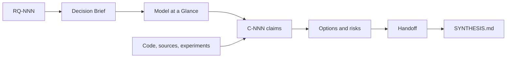

# Human-readable structured topic documents

A structured topic is one auditable, decision-relevant argument inside a
Research corpus. Topic schema 2 is optimized for two readers at once:

- a decision-maker who needs the answer, confidence, boundary, and consequence
  in the first screen;
- a reviewer who needs to trace every material claim to evidence, reasoning,
  and a falsifier.

It is not a chronological research diary and not a form with one section for
every activity performed.

## Contents

- Create a topic
- Reader contract
- Responsibility boundary
- Required reading flow
- Claim contract
- Optional modules
- Validation and compatibility



## Create a topic

Create topics only in an in-progress schema 1.1 Research:

```bash
python3 <skill-dir>/scripts/researchctl.py --repo . new-topic R-001 \
  --slug http-auth-boundary \
  --title "HTTP authentication boundary" \
  --question RQ-002 --question RQ-004 \
  --author "Security Researcher"
```

The command:

- verifies every referenced `RQ-NNN`;
- binds the topic to the current `RR-NNN`;
- creates a schema 2 topic at `notes/<slug>.md`;
- links it from the current Round's `Evidence Added`;
- registers package-local `notes/` when the Research adopted a linked corpus;
- refreshes the manifest and assigns the document `role: topic`;
- rolls back the topic, Round, and manifest together on failure.

Start a new Round before adding a topic to review-ready Research. Do not edit a
concluded package.

## Reader contract

Write in the order a human makes a decision, not the order the researcher did
the work:

1. give the answer;
2. establish the smallest useful mental model;
3. prove distinct claims;
4. compare real choices and expose uncertainty;
5. state exactly what changes downstream.

Apply these rules throughout:

- Put the conclusion before chronology, background, or methodology.
- Make each `### C-NNN` heading a complete claim, not a category such as
  "Authentication" or "Analysis."
- Keep one primary claim per block.
- Cite evidence next to the claim it supports.
- Separate observed facts from the reasoning that connects them to a decision.
- Use tables for repeated-field comparison, Mermaid for relationships or
  sequence, and prose for argument. Do not force everything into tables.
- State boundaries and falsifiers close to the affected claim.
- Do not repeat the same conclusion in separate Evidence, Analysis, Findings,
  and Synthesis-impact sections.
- Move raw logs, captures, benchmark output, and generated dumps to
  `artifacts/`; link them instead of interrupting the reading flow.
- Delete authoring instructions and empty optional material before review.

The first screen must let a reader answer: What is true? How sure are we? When
does it hold? What decision changes?

## Responsibility boundary

| Layer | Responsibility |
|---|---|
| `RESEARCH.md` | Purpose, current state, stable Questions, routing, blockers |
| Structured topic | Deep evidence and reasoning for a bounded question |
| `SYNTHESIS.md` | Bounded cross-topic recommendation and downstream handoff |

One topic may address several tightly coupled Questions. Split it when the
evidence method, decision relevance, or likely conclusion becomes independent.

## Required reading flow

Keep these schema 2 sections in relative order. Extra sections are allowed
where they improve the argument.

1. **Decision Brief** — direct answer, calibrated confidence, decision impact,
   applicability boundary, related Questions, and one short relevance
   paragraph.
2. **Model at a Glance** — the minimum diagram, protocol timeline, invariant
   list, or comparison needed to understand later claims.
3. **Claims and Evidence** — one or more auditable `C-NNN` argument blocks.
4. **Options and Trade-offs** — only credible alternatives, including evidence
   for and against each one and the conditions under which it wins.
5. **Risks, Unknowns, and Validation** — material limitations, unresolved
   questions, experiments, owners, and monitoring triggers.
6. **Handoff** — exact Synthesis delta and any justified ADR, ExecPlan,
   prototype, or monitoring consequence.
7. **Sources** — stable source registry with exact locators.
8. **Revision Notes** — factual edit history.

`Decision Brief` and `Handoff` serve different moments. The first tells a reader
what the topic currently means; the second records what downstream artifacts
must change and whether that change has been integrated.

## Claim contract

Each `C-NNN` block is a compact argument:

```markdown
### C-001 — Stateless HTTP still requires explicit session identity

**Evidence**

The handler rejects follow-up requests without the negotiated session header.
See `src/http/session.ts#validateSession` and artifact `A-004`.

**Reasoning**

Transport statelessness removes server affinity; it does not remove the
protocol-level identity needed to associate a request with negotiated state.

**Decision impact**

Keep session identity in the public HTTP contract and test it independently of
load-balancer affinity.

**Confidence**

High — implementation, protocol documentation, and integration tests agree.

**Falsifier**

A supported request flow that resumes negotiated state without any explicit or
implicit session identity would overturn this claim.
```

The heading carries the claim. The five fields answer:

| Field | Reader question |
|---|---|
| Evidence | What was actually observed, and where can I verify it? |
| Reasoning | Why does that observation support this claim? |
| Decision impact | What changes if the claim is accepted? |
| Confidence | How strong and convergent is the support? |
| Falsifier | What would overturn or materially weaken it? |

Use `High`, `Medium`, or `Low` confidence. Confidence reflects evidence quality,
independence, freshness, and contradiction; it is not rhetorical emphasis.

## Optional modules

Add an extra section only when it shortens or clarifies the core argument.
Useful examples include:

- a protocol timeline for a stateful interaction;
- an experiment matrix when several variables were controlled;
- a misconception explicitly ruled out by evidence;
- a version or platform compatibility matrix;
- a short methodology note when source selection could bias the result.

Optional modules do not become new mandatory boilerplate. Place them after the
core model or relevant claim and give them a title that tells the reader what
the section establishes.

## Validation and compatibility

`researchctl validate` enforces the schema 2 structural floor:

- schema, parent Research, Round, author field, kebab-case filename;
- a real link from the declared Round's `Evidence Added`;
- required sections and their relative order;
- at least one valid parent `RQ-NNN`;
- at least one unique `C-NNN` claim;
- Evidence, Reasoning, Decision impact, Confidence, and Falsifier in reading
  order for every claim;
- calibrated confidence vocabulary;
- manifest membership and `role: topic`.

During evidence building, unfinished quality markers are warnings. Before
`mark-review-ready`, they become errors. Cancelled Research may retain
incomplete topic content for audit.

Existing schema 1 topics remain valid and are not rewritten. Their original
14-section, `E-NNN`, and `F-NNN` contract is validated as before. New topics use
schema 2. Migrate an old topic only when an author is already revising it; do
not create churn solely to change its shape.

The validator cannot prove that a source is authoritative, a claim is correct,
alternatives are fair, or prose is easy to read. Human review still owns those
judgments.

Ordinary Markdown notes remain compatible. Strict topic validation applies
only to files that declare `doc_type: research-topic`.
