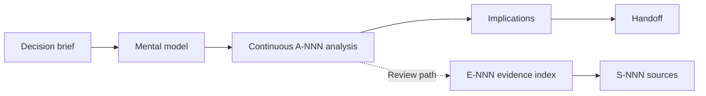

# Learning-first structured topic documents

A structured topic is one auditable explanation inside a Research corpus.
Schema 2.2 gives each topic a stable `RT-NNN` identity and serves three readers
without forcing them through the same path:

- a decision-maker can stop after the brief and implications;
- a learner can follow the mental model and continuous analysis;
- a reviewer can continue into falsifiers, the evidence index, and sources.

The analysis is the main research product. The brief navigates it, and the
evidence index audits it.

## Contents

- Create a topic
- Topic identity
- Reader contract
- Dual-speed reading flow
- Semantic roles and visible titles
- Analysis contract
- Evidence and falsifier contract
- Validation and compatibility



## Create a topic

Create topics only in an in-progress schema 1.1 Research:

```bash
python3 <skill-dir>/scripts/researchctl.py --repo . new-topic R-001 \
  --slug http-auth-boundary \
  --title "HTTP authentication boundary" \
  --question RQ-002 --question RQ-004 \
  --author "Security Researcher"
```

The command:

- verifies every referenced `RQ-NNN`;
- allocates the next non-reusable `RT-NNN` within the parent Research;
- binds the topic to the current `RR-NNN`;
- creates a schema 2.2 topic at `notes/<slug>.md`;
- links it from the current Round's `Evidence Added`;
- refreshes the manifest and records `role: topic` plus `topic_id`;
- rolls back the topic, Round, and manifest together on failure.

Start a new Round before adding a topic to review-ready Research. Do not edit a
concluded package.

## Topic identity

`RT-NNN` is unique within one `R-NNN` and remains stable when the title, slug,
file path, author, or Round changes. The filename stays semantic; identity
lives in frontmatter and the manifest:

```yaml
schema_version: "2.2"
doc_type: research-topic
parent_id: R-001
topic_id: RT-004
round_id: RR-003
```

Display the identity at the start of the H1:

```markdown
# RT-004 · Stateless HTTP and MCP session model
```

Use `R-001/RT-004/A-003` for a cross-topic audit reference. Inside `RT-004`,
the shorter `A-003`, `E-002`, and `S-001` forms remain readable and
unambiguous. Never reuse a retired Topic ID or renumber Topics to change their
reading order.

## Reader contract

Write in the order a person understands and tests an argument:

1. state the answer, confidence, consequence, and boundary;
2. establish the smallest useful mental model;
3. walk through the mechanism and causal reasoning;
4. test plausible alternatives and counterevidence;
5. derive concrete decision or architecture consequences;
6. show what evidence would change the judgment;
7. hand off downstream changes;
8. leave compact traceability for reviewers.

Apply these rules:

- Treat the brief as navigation, not a substitute for analysis.
- Make every analysis heading a complete explanatory claim.
- Develop reasoning in connected prose. Use examples, counterexamples,
  diagrams, timelines, and comparison tables when they clarify the mechanism.
- Put audit IDs after reader-facing words, for example
  `### A handle must carry explicit ownership（A-003）`.
- Cite `E-NNN` observations at the point where they affect reasoning.
- Separate observed facts from inference without splitting the document into
  repetitive Evidence, Analysis, and Findings reports.
- Put the evidence index after Handoff so audit material does not interrupt the
  ordinary reading path.
- Move raw logs, captures, benchmark output, and generated dumps to
  `artifacts/`.
- Match visible headings and language to the audience.

For a long topic, provide three short reading routes: quick decision, mechanism
learning, and full review. Do not add them when the topic is already shorter
than the routes themselves.

## Dual-speed reading flow

The ordinary reading path ends at Handoff:

```text
Brief → Mental model → Analysis → Alternatives → Implications
      → Falsifiers / validation → Handoff
```

The audit appendix follows:

```text
Evidence index → Sources → Revision notes
```

This order lets a learner encounter evidence inside the explanation while a
reviewer still gets a deterministic traceability surface.

## Semantic roles and visible titles

Schema 2.1 decouples validation from prose titles. Each required section
contains one invisible marker:

```markdown
## 进程级共享与请求级隔离可以同时成立

<!-- topic-role: mental-model -->
```

Authors may rewrite or localize the visible `##` title. Keep the
`<!-- topic-role: ... -->` marker unchanged. The required roles, in order, are:

1. `decision-brief`
2. `mental-model`
3. `analysis`
4. `alternatives`
5. `implications`
6. `falsifiers`
7. `handoff`
8. `evidence-index`
9. `sources`
10. `revision-notes`

Extra unroled sections are allowed when they improve the explanation. Do not
add a new semantic role for every optional module.

## Analysis contract

Use `A-NNN` for a distinct reasoning unit. Put the ID at the end of a
claim-bearing level-three heading:

```markdown
### TCP connection 与 MCP session 是独立边界（A-002）

A TCP connection can carry several HTTP requests. HTTP/2 can carry them
concurrently. An SSE stream belongs to one response, while a protocol session
requires an explicit cross-request mechanism. The handler creates its server
inside each request path. [E-001](#e-001) [E-005](#e-005)

This separation means connection affinity cannot provide workflow ownership or
authorization.
```

Each analysis unit must:

- contain one `A-NNN`;
- explain a mechanism or causal step in substantive prose;
- cite at least one registered `E-NNN`;
- distinguish what was observed from what was inferred;
- connect to the next reasoning step or a concrete consequence.

The structural validator uses a small prose floor to reject conclusion-only
cards. That floor cannot measure explanatory quality. Human review should ask:

- Can a reader reconstruct how the conclusion was reached?
- Are assumptions and intermediate steps visible?
- Does an example or diagram reduce cognitive load?
- Could a knowledgeable reviewer identify the weakest inference?

## Evidence and falsifier contract

The evidence index is compact:

| ID | Observation | Exact source | Supports | Confidence |
|---|---|---|---|---|
| E-001 | Handler creates one server per request. | S-001 | A-001, A-002 | High |

Each row must:

- use a unique `E-NNN`;
- state an observation, not a conclusion;
- cite exact `S-NNN` sources or auditable paths;
- name the `A-NNN` analysis sections it supports;
- use `High`, `Medium`, or `Low` confidence.

Every `E-NNN` cited by analysis must exist in the index. The index must map it
back to the same `A-NNN`. Every referenced `S-NNN` must exist in Sources.

Falsifiers stay in the reader path because they explain uncertainty:

| Affected analysis | Evidence that changes the judgment | Why it matters | Validation |
|---|---|---|---|
| A-002 | A supported path persists state across requests. | The lifecycle boundary changes. | Run a cross-request trace. |

Record evidence that would weaken or overturn a judgment, not a generic risk
inventory. Several analyses may share one falsifier when the same observation
changes them together.

## Validation and compatibility

`researchctl validate` enforces the schema 2.2 structural floor:

- schema, parent Research, stable unique Topic ID, visible H1 identity, Round,
  author field, and kebab-case filename;
- a real link from the declared Round's `Evidence Added`;
- all semantic roles exactly once and in relative order;
- at least one valid parent `RQ-NNN`;
- answer, calibrated confidence, decision impact, and applicability boundary;
- unique `A-NNN` analysis sections with substantive explanatory prose;
- bidirectional `A-NNN` ↔ `E-NNN` traceability;
- valid evidence rows, source references, and confidence vocabulary;
- analysis-linked falsifiers;
- manifest membership, `role: topic`, and matching `topic_id`.

During evidence building, unfinished quality requirements are warnings. Before
`mark-review-ready`, they become errors. Structural contradictions such as
duplicate IDs or references to unknown analysis/evidence remain errors.

Existing schema 1 topics keep their original 14-section, `E-NNN`, and `F-NNN`
contract. Existing schema 2 claim-card and schema 2.1 learning-first topics
also remain valid without Topic IDs. New topics use schema 2.2. Migrate an
older topic only when an author is already revising it; assign IDs in the
intended reading order, then keep them stable.

The validator cannot prove that prose teaches well, a source is authoritative,
an inference is correct, or counterevidence is fair. Human review owns those
judgments.

Ordinary Markdown notes remain compatible. Strict topic validation applies
only to files that declare `doc_type: research-topic`.
