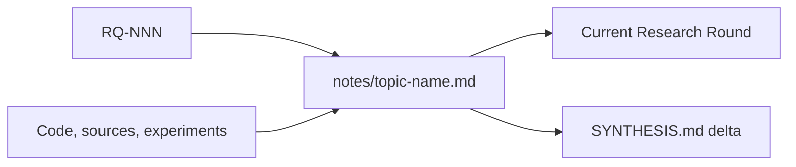

# Structured topic documents

A structured topic document is one auditable argument unit inside a Research
corpus. Use it to investigate a bounded question deeply without turning
`RESEARCH.md` into a report or making `SYNTHESIS.md` duplicate the corpus.

## Contents

- Create a topic
- Responsibility boundary
- Required argument shape
- Validation boundary



## Create a topic

Create topics only in an in-progress schema 1.1 Research:

```bash
python3 <skill-dir>/scripts/researchctl.py --repo . new-topic R-001 \
  --slug http-auth-boundary \
  --title "HTTP authentication boundary" \
  --question RQ-002 --question RQ-004 \
  --author "Security Researcher"
```

The command:

- verifies every referenced `RQ-NNN`;
- binds the topic to the current `RR-NNN`;
- writes `notes/<slug>.md` from `assets/topic.md`;
- adds the topic to the current Round's `Evidence Added`;
- registers package-local `notes/` when the Research adopted a linked corpus;
- refreshes the manifest and assigns the document `role: topic`;
- rolls back the topic, Round, and manifest together on failure.

Start a new Round before adding a topic to review-ready Research. Do not edit a
concluded package.

## Responsibility boundary

Keep the three document layers distinct:

| Layer | Responsibility |
|---|---|
| `RESEARCH.md` | Purpose, current state, stable Questions, routing, blockers |
| Structured topic | Deep evidence and reasoning for a bounded question |
| `SYNTHESIS.md` | Bounded cross-topic recommendation and downstream handoff |

One topic may address several tightly coupled Questions. Split it when the
evidence method, decision relevance, or likely conclusion becomes independent.

## Required argument shape

Keep the required sections in template order. Extra sections are allowed.

1. **Executive Takeaway** — answer, confidence, conditions, Research effect.
2. **Question and Decision Relevance** — referenced Questions and why they
   affect the downstream decision.
3. **Scope and Non-goals** — explicit investigation boundary.
4. **Current Context** — minimum system facts and terminology.
5. **Method and Evidence Selection** — source choice, freshness, exclusions.
6. **Evidence** — auditable `E-NNN` records.
7. **Analysis** — reasoning across evidence, assumptions, contradictions.
8. **Alternatives and Counterevidence** — fair competing explanations.
9. **Findings** — `F-NNN` claims with confidence, evidence, decision effect.
10. **Uncertainty and Limitations** — unknowns and falsifying observations.
11. **Impact on Synthesis** — exact accumulated conclusion delta.
12. **Next Inquiry** — exact experiment, source, Owner question, or stop reason.
13. **References and Artifacts** — portable paths and authoritative sources.
14. **Revision Notes** — factual edit history.

Each `E-NNN` record separates:

- **Observation** — what the source or experiment actually showed;
- **Evidence** — a repository path, stable source, or reproducible artifact;
- **Interpretation** — what the observation means for the question;
- **Confidence** — `High`, `Medium`, or `Low`, with a reason when useful.

Each `F-NNN` row records the finding, confidence, supporting evidence, and
effect on the decision. Preserve rejected explanations and negative evidence.

## Validation boundary

`researchctl validate` enforces the structural floor:

- schema, parent Research, Round, author field, kebab-case filename;
- a real link from the declared Round's `Evidence Added` section;
- required sections and their relative order;
- at least one valid parent `RQ-NNN`;
- unique evidence and Finding IDs;
- required evidence labels and calibrated confidence vocabulary;
- Finding evidence and decision impact;
- manifest membership and `role: topic`.

During evidence building, unfinished quality markers are warnings. Before
`mark-review-ready`, they become errors, and at least one complete `E-NNN`
record and `F-NNN` row are required. Cancelled Research may retain incomplete
topic content for audit.

The validator cannot prove that a source is authoritative, an interpretation
is correct, alternatives are fair, or confidence is well calibrated. Review
those properties as research judgment.

Ordinary Markdown notes remain compatible. Strict topic validation applies
only to files that declare `doc_type: research-topic`.
