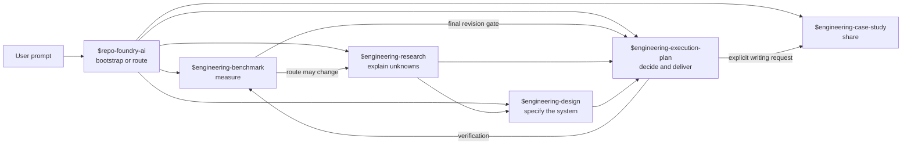
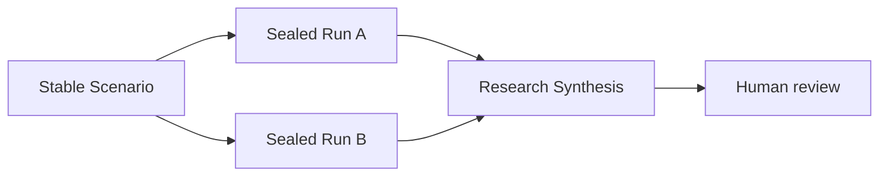
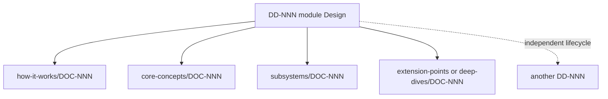
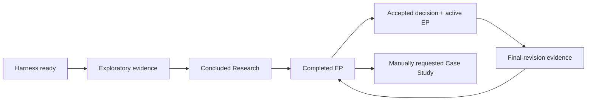

# Prompt-driven RepoFoundry AI examples

[简体中文](README.zh-CN.md) | English

These examples start from what a user says to Codex. The selected Skill may
invoke deterministic control scripts internally, but shell commands are not
the user-facing workflow.

Choose the smallest flow that fits the work. A request does not need to pass
through every Skill.



## Choose the first Skill from the user’s intent

| User intent | Start with | Typical continuation |
|---|---|---|
| Initialize an Agent-first repository or decide where work belongs | `$repo-foundry-ai` | Route to one professional Skill |
| Produce reproducible performance, capacity, reliability, or regression evidence | `$engineering-benchmark` | Research, EP, or CI / Runbook |
| Investigate unknowns, reconcile sources, or maintain a Research corpus | `$engineering-research` | Proposed ADR or another Research Round |
| Translate established evidence into system boundaries, contracts, data, flows, and failure behavior | `$engineering-design` | Design review, ADR alignment, or ExecPlan |
| Record a decision, create an ExecPlan, track a Bugfix, or drive implementation | `$engineering-execution-plan` | Benchmark gates and completion evidence |
| Turn verified engineering work into a shareable article | `$engineering-case-study` | Draft review and explicit publication verification |

## Example 1: bootstrap a repository, then route the work

Start with a non-mutating preview:

```text
Use $repo-foundry-ai to inspect this repository and preview a Codex
project Harness bootstrap.

Report which files would be created, preserved, registered, or blocked by a
conflict. Do not apply the preview. Also route the request
"redesign the tenant cache and prove its capacity" to the professional Skills
that should own measurement, unknowns, decisions, and implementation.
```

After reviewing the preview:

```text
Use $repo-foundry-ai to apply exactly the previously reviewed Harness
bootstrap. Stop if the repository changed or a conflict appears. Validate the
result and report the created entrypoints and the recommended next Skill.
```

Expected boundary: Workflow may create the Harness and recommend another Skill.
It does not create a Benchmark Run, Research, Design, ADR, ExecPlan, or Case Study on
their behalf.

## Example 2: ask the router before creating any durable artifact

Use this when the request is ambiguous:

```text
Use $repo-foundry-ai only to route this request:
"Our p95 rose after the storage migration. I need to know whether the
architecture is wrong and then fix it."

Inspect the available evidence and tell me whether to start with
$engineering-benchmark, $engineering-research, $engineering-design, or
$engineering-execution-plan. Explain the boundary and expected artifact.
Do not create a durable professional artifact yet.
```

Expected boundary: the answer distinguishes measurement, interpretation, and
implementation instead of forcing every request into one universal process.

## Example 3: let a reproducible comparison change the architecture route

```text
Use $engineering-benchmark to compare order-key strategy A and B for spans
placement.

Before running anything, define one reproducible Scenario with a falsifiable
hypothesis, controlled dataset and environment, warmup, repetitions,
correctness checks, p95/throughput metrics, and decision rules. Preserve and
seal passed, failed, inconclusive, and errored Runs.

Because the result may change the architecture, hand the sealed evidence to
$engineering-research. Have Research combine it with code and operational
evidence, retain counterevidence, and stop at review-ready. Neither Skill may
accept an ADR.
```

Expected flow:



## Example 4: take an existing corpus through Research, ADR, and ExecPlan

The detailed
[cache-topology walkthrough](cache-topology/README.md) demonstrates this flow:

```text
Use $engineering-research to take over
research-input/cache-topology/ as one linked Research.
Read the complete corpus, preserve counterevidence, and produce a
decision-ready Synthesis. Stop at review-ready and do not conclude it.
```

After explicit Research Owner conclusion, a separate prompt asks
`$engineering-execution-plan` for a proposed ADR. A Decision Owner must then
accept or reject that exact ADR before the Skill creates a gated ExecPlan.

Expected boundary: review-ready, concluded Research, proposed ADR, accepted
ADR, and active ExecPlan are separate states with separate authority.

## Example 5: turn concluded Research into one multi-document module design

Use one logical Design Package when several focused documents must be reviewed
and released together:

```text
Use $engineering-design to convert concluded R-012 into the UModel module
technical design. Use DESIGN.md for the architecture overview and organize only
the focused documents contributors need under how-it-works, core-concepts,
subsystems, extension-points, deep-dives, or contributor-guide. Keep one
DD-NNN review boundary and a root README reading map.

Preserve the Research findings, confidence limits, counterevidence, and open
unknowns. Use package-local DOC-NNN identities for jointly approved topics.
If a subdesign has a different owner or release lifecycle, give it a separate
DD-NNN and a typed dependency. Stop at review-ready; do not infer Design
approval or ADR acceptance.
```

Expected organization:



Expected boundary: Research remains evidence, the Design Package explains how
the system will work, ADR authority stays separate, and an ExecPlan can only
complete against an approved revision evidence pin.

## Example 6: use several Benchmark Scenarios as final delivery gates

The route is already accepted, so the measurements verify one final revision
rather than reopen the architecture by default.

```text
Use $engineering-execution-plan to create EP-042 from concluded R-006 and
accepted ADR-011.

Declare three independent completion gates before implementation:
BS-003 for p95 below 120 ms, BS-004 for sustained throughput above
10k spans/s, and BS-007 for recovery within 30 seconds. Explain which
milestone each Scenario governs. Do not merge them into one score.
```

After implementation:

```text
Use $engineering-benchmark to run BS-003, BS-004, and BS-007 against the same
final implementation revision. Preserve raw artifacts and seal every Run.
If a gate fails, keep the negative evidence and identify the affected EP
milestone; do not lower a threshold after seeing the result.
```

Finally:

```text
Use $engineering-execution-plan to verify EP-042.
Archive it only if every declared Scenario has exactly one passed sealed Run
for the same verified revision, all Tasks are terminal, and no blocker remains.
Otherwise keep the plan active and list the missing gates.
```

## Example 7: keep a Bugfix small, or escalate it deliberately

```text
Use $engineering-execution-plan to record the duplicate retry notification as
a Bugfix.

Capture the symptom, scope, root cause, minimal fix, verification, and evidence.
If investigation reveals a public contract change, unresolved architectural
choice, multi-milestone delivery, or a need for Research, escalate the Bugfix
to an ExecPlan and keep the linkage. Do not grow the Bugfix into an unbounded
project log.
```

Expected boundary: an ordinary coding fix remains ordinary work unless the user
asks for a durable Bugfix record. Escalation preserves the original history.

## Example 8: write a module-design article from verified evidence

Case Study is manually triggered after the user chooses the writing purpose and
language:

```text
Use $engineering-case-study to write a Simplified Chinese module-design
article about the spans aggregate planner.

Audience: engineers who will maintain the planner.
Central claim: immutable capability planning keeps transport and backend
changes from leaking into query semantics.
Use the current code, tests, R-006, ADR-011, EP-042, and its verified revision.
Build a Claim–Evidence Ledger first, preserve limitations, and create a draft.
Do not publish it or mark it verified.
```

Other article intents use the same Skill with a different narrative axis:

```text
Use $engineering-case-study to write an English best-practice article from
three real cache invalidation incidents. Explain the adoption boundary.
```

```text
Use $engineering-case-study to write a bilingual delivery case for EP-042.
Create independently readable Chinese and English drafts from one evidence
baseline.
```

```text
Use $engineering-case-study to explain the architecture evolution from
session-bound workers to explicit query handles. Write it in Simplified Chinese.
```

Expected boundary: completing an EP does not automatically create an article.
The article remains a derived narrative and never becomes the architecture
source of truth.

## A complete six-Skill journey is optional

One large feature can use every Skill, but each transition must be justified:



Use this full path only when the work actually contains each boundary. A known,
local, reversible change should not manufacture Research, a Design, an ADR,
Benchmark evidence, or a Case Study merely to fill the diagram.
