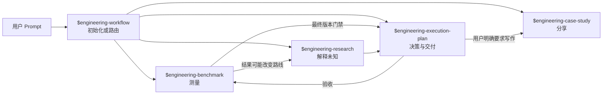
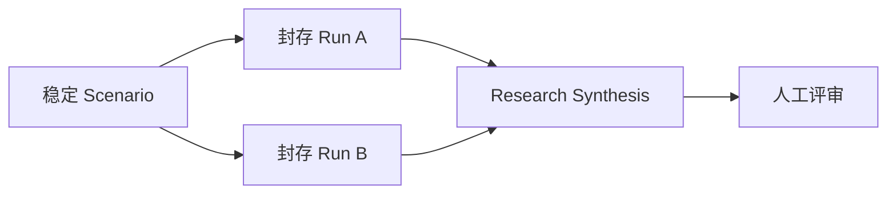
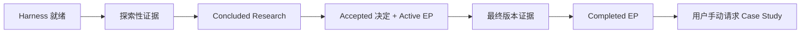

# EngineeringWorkflow Prompt 示例集

简体中文 | [English](README.md)

这些示例从用户在 Codex 中输入的话开始。Skill 可以在内部调用确定性控制脚本，
但 Shell 命令不再充当用户工作流。

选择能覆盖当前问题的最短链路。一个请求不需要机械经过所有 Skill。



## 根据用户意图选择第一个 Skill

| 用户意图 | 从这里开始 | 常见后续 |
|---|---|---|
| 初始化 Agent-first 仓库，或判断请求应由谁负责 | `$engineering-workflow` | 路由到一个专业 Skill |
| 产生可复现的性能、容量、可靠性或回归证据 | `$engineering-benchmark` | Research、EP 或 CI / Runbook |
| 调研未知、解释多来源证据、维护 Research corpus | `$engineering-research` | proposed ADR 或下一轮 Research |
| 记录决定、创建 ExecPlan、维护 Bugfix 或推动实施 | `$engineering-execution-plan` | Benchmark 门禁与完成证据 |
| 把已验证工程工作整理成可分享文章 | `$engineering-case-study` | 草稿评审与显式发布验证 |

## 示例一：先初始化仓库，再路由专业工作

第一条 Prompt 只做无写入预览：

```text
使用 $engineering-workflow 检查当前仓库，预览 Codex 项目 Harness 初始化。

报告哪些文件会被创建、保留、注册，哪些位置存在 conflict。不要应用预览。
同时把“重构 tenant cache 并证明容量”路由到分别负责测量、未知分析、
决策和实施的专业 Skill。
```

确认预览后再发第二条：

```text
使用 $engineering-workflow 应用刚才已经评审过的 Harness 初始化。
如果仓库状态变化或出现 conflict，立即停止。完成后验证 Harness，
报告生成的入口文件和推荐使用的下一个 Skill。
```

预期边界：Workflow 可以创建 Harness 并推荐后续 Skill，但不会替 Benchmark、
Research、Execution Plan 或 Case Study 创建专业制品。

## 示例二：不确定走哪条流程时只使用路由能力

```text
只使用 $engineering-workflow 路由下面的请求：
“存储迁移后 p95 上升了。我需要判断架构是否有问题，然后修复。”

检查现有证据，判断应该从 $engineering-benchmark、
$engineering-research 还是 $engineering-execution-plan 开始。
解释选择依据和预期制品，但暂时不要创建任何持久专业制品。
```

预期边界：回答会区分“测量事实、解释证据、实施修改”，不会强迫所有请求进入
一条万能流程。

## 示例三：让可复现实验影响架构路线

```text
使用 $engineering-benchmark 比较 spans placement 的 order-key 方案 A 和 B。

执行前先定义一个可复现 Scenario：写清可证伪假设、受控数据集和环境、warmup、
重复次数、正确性检查、p95/吞吐指标和判定规则。passed、failed、
inconclusive、errored Run 都要保留并封存。

这个结果可能改变架构路线。Run 封存后，使用 $engineering-research 将它与代码、
运维证据一起解释，保留反例，并停在 review-ready。两个 Skill 都不能接受 ADR。
```

预期链路：



## 示例四：把现有 corpus 推进到 Research、ADR 和 ExecPlan

[cache-topology 完整示例](cache-topology/README.md) 展示了这条链路：

```text
使用 $engineering-research 接管
research-input/cache-topology/ 下的多文档 corpus，将其组织为一个 linked Research。
完整阅读证据，保留反例和不确定性，形成决策就绪的 Synthesis。
停在 review-ready，不要 conclude。
```

Research Owner 明确结束后，另一条 Prompt 才让
`$engineering-execution-plan` 创建 proposed ADR。Decision Owner 必须对具体
ADR 明确接受或拒绝，Skill 才能创建有 Gate 的 ExecPlan。

预期边界：review-ready、concluded Research、proposed ADR、accepted ADR 和
active ExecPlan 是五个独立状态，授权也互不替代。

## 示例五：用多个 Benchmark Scenario 验收同一个最终版本

架构路线已经接受，此时 Benchmark 验证最终实现，不默认重新开启架构选择。

```text
使用 $engineering-execution-plan，基于 concluded R-006 和 accepted ADR-011
创建 EP-042。

实施前声明三个独立完成门禁：BS-003 验证 p95 低于 120 ms，
BS-004 验证持续吞吐高于 10k spans/s，BS-007 验证 30 秒内恢复。
写清每个 Scenario 约束哪个里程碑，不要合并成总分。
```

实现完成后：

```text
使用 $engineering-benchmark，在同一个最终代码 revision 上执行
BS-003、BS-004 和 BS-007。保存原始 artifacts 并封存每个 Run。
门禁失败时保留负面证据，指出受影响的 EP 里程碑；不要看到结果后降低阈值。
```

最后：

```text
使用 $engineering-execution-plan 验证 EP-042。
只有三个已声明 Scenario 都有且只有一个相同 verified revision 的 passed sealed
Run、全部 Task 已终态且没有 blocker 时，才归档 completed。
否则保持 active，并准确列出缺失门禁。
```

## 示例六：让 Bugfix 保持小而完整，必要时显式升级

```text
使用 $engineering-execution-plan，把重复发送 retry notification 记录为 Bugfix。

写清 Symptom、Scope、Root Cause、最小 Fix、Verification 和证据。
如果调查发现公共契约变化、未解决的架构选择、多里程碑交付或需要 Research，
把 Bugfix 升级为 ExecPlan 并保留关联。不要把 Bugfix 扩写成无边界项目日志。
```

预期边界：普通修复默认仍是普通编码工作；只有用户要求持久记录时才建立 Bugfix。
升级后仍保留原始缺陷历史。

## 示例七：基于已验证证据写模块设计文章

Case Study 由用户手动触发，并且先明确写作目的与语言：

```text
使用 $engineering-case-study，写一篇简体中文的 spans aggregate planner
模块设计文章。

读者：后续维护 planner 的工程师。
中心主张：不可变 capability planning 阻止 transport 和 backend 变化泄漏到
query semantics。
使用当前代码、测试、R-006、ADR-011、EP-042 及其 verified revision。
先建立 Claim–Evidence Ledger，保留局限，生成 draft。
不要发布，也不要标记 verified。
```

不同文章类型继续使用同一个 Skill，但更换叙事主轴：

```text
使用 $engineering-case-study，基于三个真实 cache invalidation 事故写一篇
英文最佳实践文章，并解释采用边界。
```

```text
使用 $engineering-case-study，基于 EP-042 写一篇中英双语交付案例。
两种语言分别成文，共用同一证据基线。
```

```text
使用 $engineering-case-study，用简体中文解释架构如何从 session-bound worker
演进到 explicit query handle。
```

预期边界：EP 完成不会自动生成文章。Case Study 是派生叙事，不能反向成为
架构事实源。

## 完整五 Skill 链路是可选项

大型功能可能经过所有 Skill，但每次转移都必须有明确理由：



只有工作确实包含这些边界时才走完整链路。方向明确、局部、可逆的改动无需为了
填满流程而制造 Research、ADR、Benchmark 证据或 Case Study。
