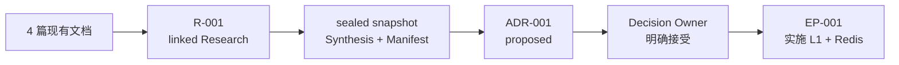

# 端到端示例：用多文档 Research 决定缓存拓扑

这个示例展示一条完整主线：注册四篇现有研究文档，形成 sealed Synthesis，经过
明确的架构授权，再创建可恢复的 ExecPlan。



示例数据是虚构的工程数据，只用于演示制品边界。尤其不要把 benchmark 数字当成
生产容量结论。

## 先复制 corpus，保留发行仓库不变

准备一个空的示例仓库。以下路径都必须替换成真实绝对路径：

```bash
export EXECUTION_PLAN_HOME=/absolute/path/to/ExecutionPlan
export EXAMPLE_REPO=/absolute/path/to/empty-cache-example
export RESEARCHCTL="$EXECUTION_PLAN_HOME/engineering-research/scripts/researchctl.py"
export EPCTL="$EXECUTION_PLAN_HOME/scripts/epctl.py"

mkdir -p "$EXAMPLE_REPO/research-input/cache-topology"
cp -R "$EXECUTION_PLAN_HOME/examples/cache-topology/corpus/." \
  "$EXAMPLE_REPO/research-input/cache-topology/"
cd "$EXAMPLE_REPO"
```

输入 corpus 有一个入口和三篇专题文档：

```text
research-input/cache-topology/
├── index.md
├── current-state.md
├── options.md
└── benchmark.md
```

`index.md` 定义决策目的、Research Questions 和阅读路线；其他文档分别保存
现状、选项和实验。它们共享同一个决策目的，因此使用一个 Research ID。

## 注册后，manifest 应明确四篇文档

```bash
python3 "$RESEARCHCTL" --repo . init
python3 "$EPCTL" --repo . init

python3 "$RESEARCHCTL" --repo . new-research \
  --slug cache-topology \
  --title "Research tenant settings cache topology" \
  --corpus-root research-input/cache-topology \
  --entrypoint research-input/cache-topology/index.md

python3 "$RESEARCHCTL" --repo . validate
```

此时控制页和 Synthesis 还没有填写，`validate` 会报告 REQUIRED placeholder
warning；corpus、manifest 和本地链接不应出现 error。

生成的控制包位于：

```text
docs/research/active/r-001_cache-topology/
├── RESEARCH.md
├── RESEARCH_MANIFEST.json
├── SYNTHESIS.md
├── notes/
└── artifacts/
```

`RESEARCH_MANIFEST.json` 的关键部分应类似下面这样。摘要在这里缩短展示，真实
文件会保存完整 SHA-256：

```json
{
  "research_id": "R-001",
  "status": "active",
  "mode": "linked",
  "entrypoints": [
    {
      "base": "repo",
      "path": "research-input/cache-topology/index.md"
    }
  ],
  "documents": [
    {
      "base": "repo",
      "path": "research-input/cache-topology/benchmark.md",
      "role": "document",
      "bytes": 1208,
      "sha256": "…"
    }
  ]
}
```

实际 manifest 必须包含四篇文档，其中 `index.md` 的 role 是 `entrypoint`。

## Research 的结论应压缩证据，不复制 corpus

在生成的 `RESEARCH.md` 中回答三个问题：

| ID | Status | Answer | Evidence |
|---|---|---|---|
| RQ-001 | answered | 数据库读取主导 p95 和后端负载 | `current-state.md` |
| RQ-002 | answered | L1 + Redis 同时满足延迟与数据库减载目标 | `benchmark.md` |
| RQ-003 | answered | tenant-safe key、5 秒 L1、30 秒 L2、独立 kill switch 必须进入决定 | `options.md` |

`SYNTHESIS.md` 的 Executive Conclusion 可以写成：

> 推荐使用 5 秒进程内 L1 加 30 秒 Redis L2。示例 benchmark 中，该方案把
> read p95 从 184 ms 降至 34 ms，把数据库读取从 1,180 q/s 降至 342 q/s。
> 推荐成立的前提是 cache key 包含 tenant_id、两层可独立关闭，并补充
> cache-age 与 invalidation-lag 指标。

同时保留负面证据：

- L1-only 的 29 ms p95 更低，但缺少可信的跨副本失效契约。
- 两层缓存增加运维和排障复杂度。
- Redis outage 与 invalidation backlog 尚未测试，必须进入 EP 验收。

完成控制页和 Synthesis 中所有 REQUIRED 内容后刷新并封存：

```bash
python3 "$RESEARCHCTL" --repo . sync-research R-001
python3 "$RESEARCHCTL" --repo . validate
python3 "$RESEARCHCTL" --repo . archive-research R-001 \
  --outcome concluded
```

linked corpus 的源文件仍留在 `research-input/cache-topology/`。completed 包中会
出现不可变快照：

```text
docs/research/completed/r-001_cache-topology/
├── RESEARCH.md
├── RESEARCH_MANIFEST.json
├── SYNTHESIS.md
└── artifacts/
    └── research-snapshot/
        └── research-input/cache-topology/
            ├── index.md
            ├── current-state.md
            ├── options.md
            └── benchmark.md
```

## ADR 必须停在 proposed，直到授权出现

Research 可以推荐 Option C，但不能自行接受架构决定：

```bash
python3 "$EPCTL" --repo . new-adr \
  --slug cache-topology \
  --title "Choose tenant settings cache topology" \
  --research R-001
```

填完 ADR 的全部 REQUIRED section，其中至少写清三项内容：

- Outcome：选择 5 秒 L1 + 30 秒 Redis L2。
- Consequences：增加 Redis 依赖、双层观测和失效排障成本。
- Confirmation：压测、tenant isolation 测试、Redis outage fallback 和
  invalidation backlog 测试。

此时 ADR 仍是 `proposed`。只有 Decision Owner 给出类似下面的明确表达，才能
执行决定命令：

```text
我以 Cache Platform Owner 身份接受 ADR-001：采用 5 秒 L1 + 30 秒 Redis L2。
```

```bash
python3 "$EPCTL" --repo . decide-adr ADR-001 \
  --outcome accepted \
  --decision-maker "Cache Platform Owner"
```

“继续”“按这个方向做”“帮我写 ADR”都不足以证明谁接受了哪份决定。

## ExecPlan 必须把上游结论带入实施上下文

```bash
python3 "$EPCTL" --repo . new-ep \
  --slug implement-cache-topology \
  --title "Implement tenant settings cache topology" \
  --research R-001 \
  --adr ADR-001
```

生成的 EP 应明确两个 Gate：

```yaml
research_refs: ["R-001"]
research_gate: satisfied
adr_refs: ["ADR-001"]
architecture_gate: satisfied
```

`Research and Architecture Inputs` 至少复述：

- 目标：read p95 低于 60 ms，数据库读取减少 60%；
- 结构：5 秒 L1、30 秒 Redis L2、数据库 source of truth；
- 安全边界：key 包含 `tenant_id` 和 cache schema version；
- 运维边界：两层独立 kill switch，Redis 失败回源数据库；
- 未完成验证：Redis outage 与 invalidation backlog。

一个可执行的里程碑序列是：

1. 冻结 cache key、TTL、fallback 和 invalidation 契约。
2. 实现 Redis L2 与数据库回源，验证 tenant isolation。
3. 实现进程内 L1 与独立 kill switch。
4. 增加 hit-rate、cache-age、fallback、invalidation-lag 指标。
5. 执行基准、Redis outage、backlog 和 canary 验收。

每个里程碑都要写真实文件路径、命令、预期输出和证据位置。实施历史增长后用
Checkpoint 封存已完成事件，根 `EXECPLAN.md` 继续保存当前事实和准确下一步。

## 三条命令验证完整链路

```bash
python3 "$RESEARCHCTL" --repo . validate
python3 "$EPCTL" --repo . validate
python3 "$EPCTL" --repo . status
```

预期结果：

- R-001 是 `concluded`，Synthesis 与 manifest 都是 sealed。
- ADR-001 是 `accepted`，并记录真实 Decision Owner。
- EP-001 是 `active`，两个 Gate 都是 `satisfied`。
- 两个 validate 命令没有 error。

这个例子刻意保留人工编辑和明确授权步骤。Research 结论与 ADR 接受不能由演示
脚本代替。
