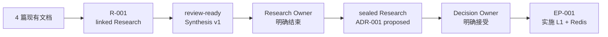

# 端到端示例：用多文档 Research 决定缓存拓扑

这个示例展示用户如何在 Codex 对话中驱动一条完整主线：接管四篇现有研究文档，
形成 review-ready Synthesis，经过 Research Owner 明确结束授权后封存，再经过
架构授权创建可恢复的 ExecPlan。用户只提供目标、上下文和授权；Skill 负责调用
确定性脚本、维护状态并验证制品。



示例数据是虚构的工程数据，只用于演示制品边界。尤其不要把 benchmark 数字当成
生产容量结论。

## 第一条 Prompt：让 Codex 接管现有 corpus

先把示例 corpus 放到目标仓库的 `research-input/cache-topology/`。如果它仍在
RepoFoundry 发行仓库中，也可以把源路径和目标路径直接告诉 Codex，让
它只复制 corpus，不修改发行仓库。

在目标仓库中发起对话：

```text
使用 $engineering-research 接管
research-input/cache-topology/ 下的现有多文档调研。

研究主题：tenant settings cache topology
Research Owner：Cache Platform Owner
Author：Codex
类型：technical
入口文档：research-input/cache-topology/index.md

先只读检查 corpus 和仓库现状，再创建一个 linked Research。保留原始文档位置，
不要结束 Research；完成后告诉我 Research ID、识别出的 Research Questions、
manifest 文件数、校验结果和下一步。
```

输入 corpus 有一个入口和三篇专题文档：

```text
research-input/cache-topology/
├── index.md
├── current-state.md
├── options.md
└── benchmark.md
```

`index.md` 定义决策目的、Research Questions 和阅读路线；其他文档分别保存
现状、选项和实验。它们共享同一个决策目的，因此使用一个 Research ID。

## Skill 建立控制包后，manifest 应明确四篇文档

Codex 触发 `engineering-research` 后，会在内部完成初始化、ID 分配、corpus
注册和校验。用户不需要定位或运行 `researchctl.py`。

此时控制页和 Synthesis 还没有填写，`validate` 会报告 REQUIRED placeholder
warning；corpus、manifest 和本地链接不应出现 error。

生成的控制包位于：

```text
docs/research/active/r-001_cache-topology/
├── RESEARCH.md
├── RESEARCH_MANIFEST.json
├── SYNTHESIS.md
├── rounds/
├── notes/
├── snapshots/
└── artifacts/
```

`RESEARCH_MANIFEST.json` 的关键部分应类似下面这样。摘要在这里缩短展示，真实
文件会保存完整 SHA-256：

```json
{
  "research_id": "R-001",
  "status": "active",
  "mode": "linked",
  "entrypoints": [
    {
      "base": "repo",
      "path": "research-input/cache-topology/index.md"
    }
  ],
  "documents": [
    {
      "base": "repo",
      "path": "research-input/cache-topology/benchmark.md",
      "role": "document",
      "sha256": "…"
    }
  ]
}
```

实际 active manifest 包含四篇输入文档和一个 `RR-001` Round；`index.md` 的
role 是 `entrypoint`。`bytes` 与完整 `sha256` 由 `researchctl` 根据源文件
生成，不在说明文档中手抄。

## Research 的结论应压缩证据，不复制 corpus

在生成的 `RESEARCH.md` 中回答三个问题：

| ID | Status | Answer | Evidence |
|---|---|---|---|
| RQ-001 | answered | 数据库读取主导 p95 和后端负载 | `current-state.md` |
| RQ-002 | answered | L1 + Redis 同时满足延迟与数据库减载目标 | `benchmark.md` |
| RQ-003 | answered | tenant-safe key、5 秒 L1、30 秒 L2、独立 kill switch 必须进入决定 | `options.md` |

`SYNTHESIS.md` 的 Executive Conclusion 可以写成：

> 推荐使用 5 秒进程内 L1 加 30 秒 Redis L2。示例 benchmark 中，该方案把
> read p95 从 184 ms 降至 34 ms，把数据库读取从 1,180 q/s 降至 342 q/s。
> 推荐成立的前提是 cache key 包含 tenant_id、两层可独立关闭，并补充
> cache-age 与 invalidation-lag 指标。

同时保留负面证据：

- L1-only 的 29 ms p95 更低，但缺少可信的跨副本失效契约。
- 两层缓存增加运维和排障复杂度。
- Redis outage 与 invalidation backlog 尚未测试，必须进入 EP 验收。

完成控制页和 Synthesis 中所有 REQUIRED 内容后，用下一条 Prompt 请求评审版本：

```text
继续使用 $engineering-research 完成 R-001。

逐篇阅读 corpus，回答全部 Research Questions；把分析过程写进结构化专题，
把证据、反例、不确定性和适用边界保留下来。SYNTHESIS.md 要面向架构决策，
明确推荐方案、成立条件、负面后果和仍需进入 EP 的验证项。

完成后同步 manifest、运行校验，并把 R-001 标记为 review-ready。不要 conclude。
请给我一份适合人工评审的摘要和文档入口。
```

这会生成 `snapshots/synthesis-v001.md`，但 R-001 仍然是 active。需要继续验证
Redis outage 时，在同一个 Research 中继续对话：

```text
R-001 的评审发现 Redis outage 和 invalidation backlog 证据不足。
使用 $engineering-research 为 R-001 开启新一轮，保留同一个 Research ID，
补充故障行为专题和可复核证据，再更新 Synthesis。不要 conclude。
```

本示例假设评审已经通过。Research Owner 必须亲自给出结束授权：

```text
我以 Cache Platform Owner 身份确认 R-001 已满足本轮决策需要。
请使用 $engineering-research 结束并归档 R-001，
将本条消息记录为明确的 Owner approval。
```

linked corpus 的源文件仍留在 `research-input/cache-topology/`。completed 包中会
出现不可变快照：

```text
docs/research/completed/r-001_cache-topology/
├── RESEARCH.md
├── RESEARCH_MANIFEST.json
├── SYNTHESIS.md
├── rounds/
├── snapshots/
└── artifacts/
    └── research-snapshot/
        └── research-input/cache-topology/
            ├── index.md
            ├── current-state.md
            ├── options.md
            └── benchmark.md
```

## ADR 必须停在 proposed，直到授权出现

Research 可以推荐 Option C，但不能自行接受架构决定。下一条 Prompt 只要求创建
proposed ADR：

```text
使用 $engineering-execution-plan 消费已 concluded 的 R-001。
为 tenant settings cache topology 创建一份原子的 ADR，比较可行选项，
推荐 5 秒 L1 + 30 秒 Redis L2，并写清后果和确认方式。
ADR 必须停在 proposed；不要替 Decision Owner 接受。
```

填完 ADR 的全部 REQUIRED section，其中至少写清这些内容：

- Outcome：选择 5 秒 L1 + 30 秒 Redis L2。
- Decision Statement：tenant settings read path 必须采用数据库为 source of truth
  的 5 秒 L1 + 30 秒 Redis L2。
- Normative Constraints：用稳定编号记录可被 EP 引用的约束，例如
  `C-001` tenant-safe key、`C-002` TTL 与数据库回源、`C-003` 两层独立
  kill switch；每条都写明作用范围和机械确认方式。
- Consequences：增加 Redis 依赖、双层观测和失效排障成本。
- Confirmation：压测、tenant isolation 测试、Redis outage fallback 和
  invalidation backlog 测试。

此时 ADR 仍是 `proposed`。只有 Decision Owner 给出类似下面的明确表达，Skill
才能记录决定：

```text
我以 Cache Platform Owner 身份接受 ADR-001：采用 5 秒 L1 + 30 秒 Redis L2。
```

“继续”“按这个方向做”“帮我写 ADR”都不足以证明谁接受了哪份决定。

## ExecPlan 必须把上游结论带入实施上下文

```text
使用 $engineering-execution-plan，基于 R-001 和已接受的 ADR-001，
创建“Implement tenant settings cache topology” ExecPlan。

计划必须复述 Research 的约束和负面后果，写明 Research Gate 与
Architecture Gate，给出真实文件路径、里程碑、验证命令、回滚方式和完成证据。
先创建并评审计划，不要开始实现。
```

生成的 EP 应明确 Research Gate、Architecture Decision Gate 与持续合规状态：

```yaml
research_refs: ["R-001"]
research_gate: satisfied
adr_refs: ["ADR-001"]
adr_constraint_refs: ["ADR-001#C-001", "ADR-001#C-002", "ADR-001#C-003"]
architecture_decision_gate: satisfied
architecture_compliance: applicable
```

`Research and Architecture Inputs` 至少复述：

- 目标：read p95 低于 60 ms，数据库读取减少 60%；
- 结构：5 秒 L1、30 秒 Redis L2、数据库 source of truth；
- 安全边界：key 包含 `tenant_id` 和 cache schema version；
- 运维边界：两层独立 kill switch，Redis 失败回源数据库；
- 未完成验证：Redis outage 与 invalidation backlog。

`Architecture Compliance Matrix` 必须把 `ADR-001#C-001` 至
`ADR-001#C-003` 各映射一次到实施位置和验证方式。Design Doc 可以解释实现，
但不能静默覆盖这些 ADR 约束。

一个可执行的里程碑序列是：

1. 冻结 cache key、TTL、fallback 和 invalidation 契约。
2. 实现 Redis L2 与数据库回源，验证 tenant isolation。
3. 实现进程内 L1 与独立 kill switch。
4. 增加 hit-rate、cache-age、fallback、invalidation-lag 指标。
5. 执行基准、Redis outage、backlog 和 canary 验收。

每个里程碑都要写真实文件路径、命令、预期输出和证据位置。实施历史增长后用
Checkpoint 封存已完成事件，根 `EXECPLAN.md` 继续保存当前事实和准确下一步。

## 完成时绑定真实代码版本与证据

只有真实实现和全部验收完成后，才能请求 Skill 归档：

```text
继续使用 $engineering-execution-plan 核对 EP-001。
只有全部验收真实通过、没有 open blocker、所有 Task 已终态时才归档 completed。
verified_revision 必须使用实际通过验收的代码 revision，
verification_evidence 必须引用真实 CI 和仓库内验收产物。
如果条件不满足，保持 active 并准确列出缺口。
```

`verified_revision` 绑定“哪些代码被验证过”，evidence 绑定“在哪里可以复核”。
复选框全部勾选但缺少这两类信息时，v2.6 EP 仍不能完成。非 Git 仓库可以使用
稳定的 `snapshot:<id>`；该契约不依赖 GitHub 或 GitLab。

## 最后一条 Prompt 验证完整链路

```text
使用 $engineering-research 和 $engineering-execution-plan
对 R-001、ADR-001、EP-001 做最终一致性检查。
验证 manifest、Synthesis seal、Owner 授权、Research/Architecture Decision Gate、
ADR 约束的 Architecture Compliance Matrix、
verified revision 和 evidence，并报告任何 error；不要用自动修复掩盖问题。
```

预期结果：

- R-001 是 `concluded`，Synthesis 与 manifest 都是 sealed。
- ADR-001 是 `accepted`，并记录真实 Decision Owner。
- 实施前 EP-001 是 `active`，Research 与 Architecture Decision Gate 都是
  `satisfied`，Architecture Compliance 是 `applicable`；真实验收和上述归档
  Prompt 完成后，它才是带 revision/evidence 的 sealed `completed`。
- Research 与 Execution Plan 的校验都没有 error。

这个例子刻意保留 Research 分析、Research Owner 结束授权和 Decision Owner
架构授权三个不同步骤。`researchctl` 与 `epctl` 是 Skill 内部的确定性执行机制，
不应成为用户学习这条工作流的入口。
