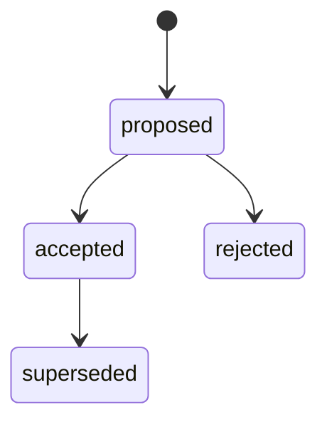

# ADR 与 Architecture Gate

## 目标

ADR 保存一个长期有效、具有架构意义的决定。它解释问题、决策驱动因素、可信选项、选择理由、后果和确认方式。

ADR 位于稳定路径：

```text
docs/adr/adr-NNN_slug.md
```

路径不随状态移动。`docs/DECISIONS.md` 是可重建索引。

## 何时需要 ADR

当存在两个以上可信选项，并至少满足一项时创建 ADR：

- 影响公共 API、事件、schema、配置或兼容协议。
- 跨模块、服务或团队边界。
- 形成长期技术约束。
- 迁移或逆转成本较高。
- 涉及安全、数据一致性、可靠性或部署拓扑。

局部实现细节、执行顺序和容易逆转的策略写入 ExecPlan Decision Log。没有架构级选择时，创建 ExecPlan 必须写明 `architecture-not-required` 理由。

## 必需内容

- Context and Problem Statement
- Decision Drivers
- Research Evidence
- Considered Options
- Decision Outcome
- Consequences
- Confirmation
- Revisit Triggers
- More Information
- Revision Notes

Research Evidence 应复述 sealed Synthesis 的决策级结论并提供路径。ADR 读者不需要重建全部 Research。

## 状态



- `proposed`：可由 Agent 起草和修订。
- `accepted`：明确 Decision Owner 批准，成为当前架构约束。
- `rejected`：明确 Decision Owner 拒绝，保留原因。
- `superseded`：被新的 accepted ADR 替代。

只有 proposed ADR 可以执行 `decide-adr`。命令要求 `--decision-maker`；skill 还要求本轮对话存在用户或 Decision Owner 的明确授权。脚本记录授权主体，不能推断授权。

accepted 和 rejected ADR 的正文带 SHA-256。决定后修改正文会使 `validate` 失败。元数据可以增加 supersession 链，但决策内容保持不变。

## Supersession

架构决定发生变化时：

1. 创建新的 proposed ADR，引用新 Research。
2. 完整说明旧决定为何不再满足 Decision Drivers。
3. 获得明确授权并接受新 ADR。
4. 运行 `supersede-adr ADR-OLD --by ADR-NEW`。
5. 更新受影响的 active ExecPlan。

新 ADR 必须为 accepted。旧 ADR 变为 superseded 并填写 `superseded_by`；新 ADR 的 `supersedes` 增加旧 ID。active ExecPlan 引用 superseded ADR 时验证失败，直到引用和执行约束同步更新。

## Architecture Gate

ExecPlan 只能通过以下方式满足 Gate：

- `architecture_gate: satisfied`，并引用至少一个当前 accepted ADR；或
- `architecture_gate: not_required`，并记录具体理由。

proposed、rejected 和 superseded ADR 都不能满足 Gate。

ExecPlan 必须在 `Research and Architecture Inputs` 中复述：

- 选择的架构方向。
- 对模块、接口、数据和部署的约束。
- 负面后果与迁移义务。
- ADR Confirmation 如何进入测试、lint 或验收。

引用提供审计链；根 ExecPlan 仍需自包含。
