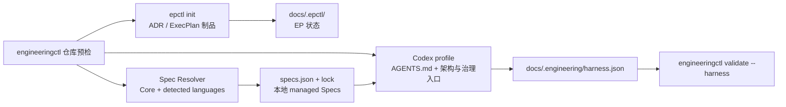

# Codex 项目文档 Bootstrap

## 目标

`engineering-workflow` Bootstrap 建立 Codex 可导航、EP 可治理、CI 可验证的
项目文档控制面。它负责知识入口、组合初始化和文件契约，不负责生成未经验证的
项目事实。



## `init` 与 `bootstrap`

`engineering-execution-plan` 的 `epctl init` 是低层、Agent 中立的幂等操作，
只创建 EP 自己拥有的目录、索引和 ID 状态。它的行为不能因 Codex profile
改变。

`engineering-workflow` 的 `bootstrap` 是显式选择的项目级操作：

- 默认 dry-run；
- 只在 `--apply` 时写入；
- apply 组合 `epctl init`；
- 只创建缺失路径；
- 将 `docs/design-docs` 注册为 architecture root；
- 创建并启用 Harness manifest；
- 安装必选 Core Spec 和检测到的 Go、TypeScript、Python Spec；
- 生成 Spec manifest、lock、本地副本与按作用域路由索引；
- 写入后立即执行 Harness 验证。

已有内容文档保持字节不变。唯一允许修改的既有 managed file 是
`docs/.epctl/config.json`，且只追加 `docs/design-docs` architecture root。
Bootstrap 不隐式运行 `reindex`。

## 使用

在目标仓库根目录运行：

```bash
python3 <workflow-dir>/scripts/engineeringctl.py --repo . \
  bootstrap --profile codex
```

输出 JSON 中的 action 包括：

| Action | 含义 |
|---|---|
| `create_directory` | apply 将创建缺失目录 |
| `create_file` | apply 将从 bundled asset 创建缺失文件 |
| `register` | apply 将注册 architecture root |
| `preserve` | 已有路径保持原样 |
| `conflict` | apply 会在写入前失败 |

显式 `--dry-run` 与默认行为相同。确认预览后执行：

```bash
python3 <workflow-dir>/scripts/engineeringctl.py --repo . \
  bootstrap --profile codex --apply
```

## 初始化结构

Codex profile 在 EP 布局之外增加：

```text
AGENTS.md
ARCHITECTURE.md
docs/
├── .engineering/
│   ├── harness.json
│   ├── specs.json
│   └── specs.lock.json
├── agent-guides/
│   └── managed/
│       ├── index.md
│       ├── core/semantic-naming.md
│       └── languages/<selected-language>.md
├── index.md
├── QUALITY_SCORE.md
├── RELIABILITY.md
├── SECURITY.md
└── design-docs/
    └── index.md
```

`docs/RESEARCH.md`、`docs/DECISIONS.md`、`docs/PLANS.md`、
`docs/BUGFIXES.md` 及其事实制品目录仍由 `init` 创建。

Bootstrap templates 是明确标记的 scaffold。Agent 应在同一初始化工作中检查
README、代码、构建文件、测试和 CI，再用真实事实替换
`BOOTSTRAP_TODO`。无法验证的字段保持 `unknown`，不能猜测命令、边界、Owner、
SLO 或安全控制。

## Engineering Specs

Bundled Catalog 位于 Workflow distribution 的 `engineering-specs/`。Bootstrap
永远选择 `core/semantic-naming`，并根据 `go.mod` / `*.go`、
`tsconfig.json` / TypeScript 源文件、`pyproject.toml` / Python 源文件选择语言
Spec。多语言仓库组合多个语言 Spec，不加载未匹配语言。

项目选择保存在 `docs/.engineering/specs.json`；精确版本、Catalog digest、
内容 SHA-256 和本地路径保存在 `specs.lock.json`。Catalog 内容原样物化到
`docs/agent-guides/managed/`，生成的 `index.md` 把文件作用域映射到对应 Spec。
根 `AGENTS.md` 只保留一条读取该索引的短路由。

项目特有规则不进入托管目录。在 `specs.json` 的 `project_specs` 中登记已有
Markdown 路径、作用域和说明，`index.md` 会引用它，工具不复制或修改正文。

Spec 操作同样 preview-first：

```bash
python3 <workflow-dir>/scripts/engineeringctl.py --repo . spec plan
python3 <workflow-dir>/scripts/engineeringctl.py --repo . spec sync
python3 <workflow-dir>/scripts/engineeringctl.py --repo . spec sync --apply
python3 <workflow-dir>/scripts/engineeringctl.py --repo . spec update --apply
python3 <workflow-dir>/scripts/engineeringctl.py --repo . spec validate
```

`sync` 遵循已有 manifest；`update` 加入新检测到的语言并刷新已选 Catalog
内容，但不自动移除选择。显式 applied Spec 操作可以在预览后替换生成的 lock、
index 和 managed Spec；Bootstrap 本身遇到内容漂移仍报告 conflict。

默认 Catalog 随 Workflow 打包。需要独立 Catalog 仓库时，先把它作为目标仓库内
的 versioned checkout 或 submodule，再把 manifest source 设置为
`{"kind": "path", "path": "<repository-relative-directory>"}`。V1 不在
Bootstrap 中隐式联网、克隆 Git 或管理凭据。

## `AGENTS.md` 硬约束

每个 Harness manifest 注册的 instruction file 必须不超过 100 个物理行：

- 空行计数；
- Markdown 注释计数；
- frontmatter 计数；
- 文件末尾换行不额外增加一行；
- 第 101 行使 Bootstrap apply 和 Harness validation 失败。

Bundled template 必须不超过 80 行，为项目特定说明保留至少 20 行。需要更多内容
时，将正文下沉到 `ARCHITECTURE.md`、`docs/index.md` 或专题文档，在
`AGENTS.md` 中只保留短入口。

工具永远不会通过截断、删除空行或覆盖已有文件来修复超限。先由人或 Agent 提出
拆分，再显式修改原文件。

## 非破坏性预检

apply 前检查全部目标：

- 文件已存在：preserve；
- 目录已存在：reuse；
- 文件和目录类型相反：conflict；
- 任意 managed path 穿过 symlink：conflict；
- 已有 Harness manifest 与当前 schema 不一致：conflict；
- Spec manifest、Catalog、依赖图或项目 Spec 引用无效：conflict；
- 已有 lock、路由索引或 managed Spec 与期望 bytes 不同：conflict；
- 已有 `AGENTS.md` 超过 100 行：conflict；
- architecture config 无效：conflict。

出现 conflict 时，不创建 `docs/`、lock、manifest 或其他模板。修复冲突后重新
运行 dry-run。

## Harness Manifest

`docs/.engineering/harness.json` schema version 1 固定记录：

```json
{
  "version": 1,
  "owner": "engineering-workflow",
  "profile": "codex",
  "components": [
    "engineering-execution-plan"
  ],
  "instruction_files": [
    {
      "path": "AGENTS.md",
      "max_lines": 100
    }
  ],
  "required_files": [
    "AGENTS.md",
    "ARCHITECTURE.md",
    "docs/index.md",
    "docs/QUALITY_SCORE.md",
    "docs/RELIABILITY.md",
    "docs/SECURITY.md",
    "docs/design-docs/index.md"
  ]
}
```

项目级 Manifest 与 `docs/.epctl/config.json` 分属不同状态目录。
`config.json` 继续只负责 EP 的 architecture roots；不要借 Bootstrap 静默升级
其 schema。

## 验证

显式要求 Harness：

```bash
python3 <workflow-dir>/scripts/engineeringctl.py --repo . validate --harness
```

只要 manifest 已存在，普通 `validate` 也会自动检查：

- manifest schema 和 profile；
- required file 是否存在且为非 symlink regular file；
- `docs/design-docs` 是否已注册；
- `AGENTS.md` 物理行数；
- Spec manifest、Catalog digest、lock 和 managed content；
- 项目 Spec 路径与生成的作用域路由索引；
- scaffold TODO。

缺文件、manifest 无效、未注册 architecture root 和超过 100 行属于 error。
`BOOTSTRAP_TODO` 以及 81–100 行的 instruction file 属于 warning。
已有 `AGENTS.md` 缺少 Spec index 路由也属于 warning，工具不会为修复路由而
改写项目文件。

## 边界

Bootstrap 当前只建立文档与 Engineering Spec 控制面。Worktree、浏览器控制、
可观测性环境、权限、远程 Catalog 获取、部署和自动合并属于运行时 Harness；
在出现独立生命周期前，不把它们隐式加入本命令。
