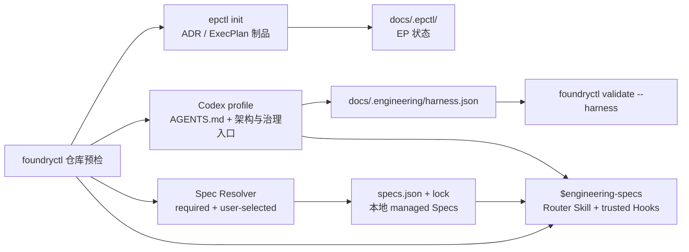
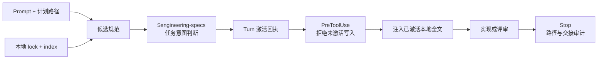

# Codex 项目文档 Bootstrap

## 目标

`repo-foundry-ai` Bootstrap 建立 Codex 可导航、EP 可治理、CI 可验证的
项目文档控制面。它负责知识入口、组合初始化和文件契约，不负责生成未经验证的
项目事实。



## `init` 与 `bootstrap`

`engineering-execution-plan` 的 `epctl init` 是低层、Agent 中立的幂等操作，
只创建 EP 自己拥有的目录、索引和 ID 状态。它的行为不能因 Codex profile
改变。

`repo-foundry-ai` 的 `bootstrap` 是显式选择的项目级操作：

- 默认 dry-run；
- 只在 `--apply` 时写入；
- apply 组合 `epctl init`；
- 只创建缺失路径；
- 将 `docs/design-docs` 注册为 architecture root；
- 创建并启用 Harness manifest；
- 安装必选 Core Spec 和用户显式选择的可选 Spec；
- 将确定性检测结果作为推荐展示，不据此自动安装；
- 生成 Spec manifest、lock、本地副本与按作用域路由索引；
- 生成一个项目级 `$engineering-specs` Router Skill 与 Codex Hook groups；
- 写入后立即执行 Harness 验证。

已有内容文档保持字节不变。唯一允许修改的既有 managed file 是
`docs/.epctl/config.json`，且只追加 `docs/design-docs` architecture root。
Bootstrap 不隐式运行 `reindex`。

## 使用

在目标仓库根目录运行：

```bash
python3 <repo-foundry-ai-dir>/scripts/foundryctl.py --version
python3 <repo-foundry-ai-dir>/scripts/foundryctl.py --repo . \
  bootstrap --profile codex
```

输出 JSON 中的 action 包括：

| Action | 含义 |
|---|---|
| `create_directory` | apply 将创建缺失目录 |
| `create_file` | apply 将从 bundled asset 创建缺失文件 |
| `register` | apply 将注册 architecture root |
| `preserve` | 已有路径保持原样 |
| `remove_file` | 显式取消选择后删除摘要仍匹配旧 lock 的托管 Spec |
| `conflict` | apply 会在写入前失败 |

显式 `--dry-run` 与默认行为相同。确认预览后执行：

```bash
python3 <repo-foundry-ai-dir>/scripts/foundryctl.py --repo . \
  bootstrap --profile codex --spec languages/go --apply
```

## 初始化结构

Codex profile 在 EP 布局之外增加：

```text
AGENTS.md
ARCHITECTURE.md
docs/
├── .engineering/
│   ├── harness.json
│   ├── specs.json
│   └── specs.lock.json
├── agent-guides/
│   └── managed/
│       ├── index.md
│       ├── core/semantic-naming.md
│       └── languages/<selected-language>.md
├── index.md
├── QUALITY_SCORE.md
├── RELIABILITY.md
├── SECURITY.md
└── design-docs/
    └── index.md
.agents/
└── skills/
    └── engineering-specs/
        ├── SKILL.md
        ├── agents/openai.yaml
        └── scripts/spec_router.py
.codex/
└── hooks.json
```

`docs/RESEARCH.md`、`docs/DECISIONS.md`、`docs/PLANS.md`、
`docs/BUGFIXES.md` 及其事实制品目录仍由 `init` 创建。

Bootstrap templates 是明确标记的 scaffold。Agent 应在同一初始化工作中检查
README、代码、构建文件、测试和 CI，再用真实事实替换
`BOOTSTRAP_TODO`。无法验证的字段保持 `unknown`，不能猜测命令、边界、Owner、
SLO 或安全控制。

## 版本与 Harness 升级

RepoFoundry 使用四条独立版本线，不能互相替代：

| 版本线 | 当前值 | 职责 |
|---|---:|---|
| RepoFoundry distribution | `0.1.0` | Skill、脚本和随版本附带的迁移能力 |
| Harness schema | `2` | `harness.json` 的数据结构 |
| Codex profile | `1.0.0` | Seed 集合、模板版本和生成行为 |
| Engineering Specs Catalog | 默认 `1.2.0` | 独立选择和锁定的工程规范 |

每次发布都更新 distribution `VERSION`；只要 seed bytes、seed 集合或 profile 行为
变化，就必须同时提升 profile 版本并提供迁移。Harness JSON 结构或语义变化时提升
schema。不能在 profile 版本不变时替换 bundled template bytes。

旧 schema `1` 继续可读并产生 `HARNESS_SCHEMA_UPGRADE_AVAILABLE` warning；普通
`bootstrap` 不会改写它。显式预览和应用迁移：

```bash
python3 <repo-foundry-ai-dir>/scripts/foundryctl.py --repo . \
  upgrade --to 0.1.0
python3 <repo-foundry-ai-dir>/scripts/foundryctl.py --repo . \
  upgrade --to 0.1.0 --apply
```

`upgrade` 默认 dry-run。apply 会持有 Harness lock 并重新计算计划；计划变化或存在
conflict 时不写入。对 seed 文件的处理只依赖 manifest 中的 SHA-256 证据：

- 文件等于当前模板：只更新 provenance；
- 文件等于旧记录的 `installed_sha256`：可以安全替换为新模板；
- versioned 文件已被修改：报告 conflict，要求人工合并；
- `legacy-unversioned` 文件与当前模板不同：保留原字节，不自动覆盖；
- 写入后验证失败：回滚本次触碰的所有文件。

迁移计划新增的 action：

| Action | 含义 |
|---|---|
| `record_provenance` | 文件已等于当前模板，只登记可信来源 |
| `update_metadata` | 文件字节已是当前模板，升级旧 metadata |
| `create_file` | 新 profile 引入的 generated Router / Hook seed 缺失，apply 时创建 |
| `replace_file` | 文件仍等于旧安装摘要，可安全采用新模板 |
| `update_manifest` | 写入 producer/profile、file records 和 migration history |
| `preserve` | 定制或来源未知的 seed 保持不变 |
| `conflict` | 缺文件、路径不安全或 versioned seed 已漂移；apply 拒绝全部写入 |

当前安装只执行自身携带、目标为 `0.1.0` 的迁移，不下载或执行远程迁移代码。
重复 apply 是幂等操作。

## Engineering Specs

Catalog 与规范正文位于独立的
[EngineeringSpecifications](https://github.com/XiaoWeiKIN/EngineeringSpecifications)
Git 仓库。默认 Catalog 版本是 `1.2.0`；首次 Bootstrap 可通过
`--spec-repository` 与 `--spec-version` 覆盖。manifest 记录
`refs/tags/v1.2.0`；解析器验证 tag 内的 `catalog_version` 完全一致。
`--spec-ref` 仅用于显式开发分支、tag 或 commit。Bootstrap 永远选择 Catalog 中
`required: true` 的 Core Spec。`go.mod` / `*.go` 等确定性证据只把对应语言 Spec
列入 `recommended_specs`；用户重复传入 `--spec <id>` 才安装可选 Spec。多语言
仓库可显式组合多个语言 Spec；解析器自动补齐 `requires` 依赖闭包。

项目选择保存在 `docs/.engineering/specs.json`；精确版本、Catalog digest、
解析后的完整 Git commit、内容 SHA-256 和本地路径保存在
`specs.lock.json`。Catalog 内容原样物化到 `docs/agent-guides/managed/`，
生成的 `index.md` 把文件作用域映射到对应 Spec。根 `AGENTS.md` 只保留一条
强制进入 `$engineering-specs` 的短路由；Router 才把该索引作为锁定的候选来源。

项目特有规则不进入托管目录。在 `specs.json` 的 `project_specs` 中登记已有
Markdown 路径、作用域和说明，`index.md` 会引用它，工具不复制或修改正文。

Spec 操作同样 preview-first：

```bash
python3 <repo-foundry-ai-dir>/scripts/foundryctl.py --repo . spec plan
python3 <repo-foundry-ai-dir>/scripts/foundryctl.py --repo . \
  spec update --spec languages/go
python3 <repo-foundry-ai-dir>/scripts/foundryctl.py --repo . spec sync
python3 <repo-foundry-ai-dir>/scripts/foundryctl.py --repo . spec sync --apply
python3 <repo-foundry-ai-dir>/scripts/foundryctl.py --repo . spec update --spec-version 1.2.0 --apply
python3 <repo-foundry-ai-dir>/scripts/foundryctl.py --repo . spec validate
```

`spec plan` 的 JSON 同时展示 `available_specs`、`required_specs`、
`recommended_specs`、`configured_specs` 与依赖闭包后的 `selected_specs`。`sync`
使用 lock 已记录的 commit，并且永不改变选择；lock 缺失时才从 manifest 的版本 tag
建立初始解析。生产升级必须通过 `update --spec-version MAJOR.MINOR.PATCH` 明确选择
新版本；`update --spec-ref ...` 只用于显式开发源。没有选择参数时 update 保留当前
集合；重复 `--spec <id>` 会替换完整可选直接集合，`--required-only` 清空可选集合。
取消选择时，只删除字节仍匹配旧 lock 的 RepoFoundry 托管副本；漂移会在写入前失败。
显式 applied Spec 操作可以在预览后替换生成的 lock、index 和 managed Spec；
Bootstrap 本身遇到内容漂移仍报告 conflict。`spec validate` 只检查 manifest、
lock 与本地文件，完全不访问网络。

解析器通过临时 bare Git object store 读取 Catalog 与 Markdown，不 checkout、
不执行远程代码。Git 凭据只能来自用户已有的 credential helper 或 SSH agent；
RepoFoundry AI 不接收、不打印、不保存 token。

## 任务时激活

Bootstrap 不会为每份规范创建一个 Skill，而是只生成
`.agents/skills/engineering-specs/`。这个 Router Skill 先根据计划修改路径与
`applies_to` 返回候选，再要求 Agent 读取候选的 description 与 Applicability，
记录当前 Turn 的适用 ID 或显式 `none` 决定。激活一个规范时自动加入它的
`requires` 闭包。



生成的 `.codex/hooks.json` 注册：

- `UserPromptSubmit`：建立基线，并把 Router 命令与本地索引加入 developer context；
- `SubagentStart`：让子 Agent 继承同一任务激活契约；
- `PreToolUse`：允许发现性读取；没有激活回执、目标路径未覆盖时拒绝写入；第一次
  写入前注入摘要已验证的本地全文，并要求重试；
- `Stop`：比较 Prompt 时的 Git 基线与当前状态，检查路径覆盖和五字段 Agent 交接。

运行时回执按 repository/session/turn 隔离，写入 Git metadata 或系统临时目录，
不会成为隐藏的项目规范。Router 全程离线，不从远端加载正文。确实没有适用规范时，
仍必须用 `--none --reason ...` 记录决定。

项目级 Hooks 只在用户信任该项目时加载；非托管命令 Hook 还需要通过 Codex
`/hooks` 审查并信任精确版本。这个信任边界无法由仓库文件替用户决定。Hook 被禁用
或项目不受信任时，`AGENTS.md` 与 Skill 仍提供工作流：Agent 必须先运行 Router
的 `begin` 建立手动 Turn 基线，再执行 candidates/activate，并在完成前用带五字段
handoff 的 `audit --message` 检查路径。此时不应声称存在机械写入门禁。

## `AGENTS.md` 硬约束

每个 Harness manifest 注册的 instruction file 必须不超过 100 个物理行：

- 空行计数；
- Markdown 注释计数；
- frontmatter 计数；
- 文件末尾换行不额外增加一行；
- 第 101 行使 Bootstrap apply 和 Harness validation 失败。

Bundled template 必须不超过 80 行，为项目特定说明保留至少 20 行。需要更多内容
时，将正文下沉到 `ARCHITECTURE.md`、`docs/index.md` 或专题文档，在
`AGENTS.md` 中只保留短入口。

工具永远不会通过截断、删除空行或覆盖已有文件来修复超限。先由人或 Agent 提出
拆分，再显式修改原文件。

## 非破坏性预检

apply 前检查全部目标：

- 文件已存在：preserve；
- 目录已存在：reuse；
- 文件和目录类型相反：conflict；
- 任意 managed path 穿过 symlink：conflict；
- 已知的 legacy schema `1`：preserve 并提示显式 upgrade；
- 无效或比当前工具更新的 Harness schema / producer / profile：conflict；
- Spec manifest、Catalog、依赖图或项目 Spec 引用无效：conflict；
- 已有 lock、路由索引或 managed Spec 与期望 bytes 不同：conflict；
- 已有 `AGENTS.md` 超过 100 行：conflict；
- 已有 `AGENTS.md` 缺少 `$engineering-specs` 强制路由：conflict；
- 生成的 Router Skill 漂移、路径冲突或经过 symlink：conflict；
- 已有 `.codex/hooks.json` 缺少所需 groups：conflict，保留原字节并要求显式合并；
- architecture config 无效：conflict。

出现 conflict 时，不创建 `docs/`、lock、manifest 或其他模板。修复冲突后重新
运行 dry-run。

## Harness Manifest

`docs/.engineering/harness.json` schema version 2 固定记录产品、profile、seed
provenance 与已应用迁移。下面省略其余同构的 file entries：

```json
{
  "schema_version": 2,
  "owner": "repo-foundry",
  "producer": {
    "name": "repo-foundry",
    "version": "0.1.0"
  },
  "profile": {
    "id": "codex",
    "version": "1.0.0"
  },
  "components": [
    "engineering-execution-plan"
  ],
  "instruction_files": [
    {
      "path": "AGENTS.md",
      "max_lines": 100
    }
  ],
  "required_files": [
    "AGENTS.md",
    "ARCHITECTURE.md",
    "docs/index.md",
    "docs/QUALITY_SCORE.md",
    "docs/RELIABILITY.md",
    "docs/SECURITY.md",
    "docs/design-docs/index.md"
  ],
  "files": [
    {
      "path": "AGENTS.md",
      "ownership": "seeded",
      "template_id": "codex/agents",
      "template_version": "1.0.0",
      "template_sha256": "<lowercase SHA-256>",
      "installed_sha256": "<lowercase SHA-256>"
    }
  ],
  "applied_migrations": []
}
```

实际 manifest 的 `files` 按 profile 固定顺序包含 11 个 seed：七个可由项目继续
维护的文档，以及 Router Skill 三个文件和 `.codex/hooks.json` 四个严格生成文件。
`required_files` 为兼容 schema `1` 继续表示七个文档入口。Bootstrap 时已经与
bundled template 相同的文件记录版本和两个 digest；无法证明来源的既有文档记录为
`template_version: "legacy-unversioned"` 且两个 digest 为 `null`。严格生成文件若
已存在但字节不同则 conflict；旧 profile 尚未包含且路径缺失时，upgrade 可以创建。

schema `1` 和 owner 为 `engineering-workflow` 的既有 Manifest 继续以兼容模式读取，
分别产生 `HARNESS_SCHEMA_UPGRADE_AVAILABLE` 和 `HARNESS_LEGACY_OWNER` warning；
新 Manifest 一律写入 schema `2` 与 owner `repo-foundry`。高于当前能力的 schema、
producer、profile、template 或 migration 版本拒绝读取，防止旧工具误写新状态。

项目级 Manifest 与 `docs/.epctl/config.json` 分属不同状态目录。
`config.json` 继续只负责 EP 的 architecture roots；不要借 Bootstrap 静默升级
其 schema。

## 验证

显式要求 Harness：

```bash
python3 <repo-foundry-ai-dir>/scripts/foundryctl.py --repo . validate --harness
```

只要 manifest 已存在，普通 `validate` 也会自动检查：

- manifest schema 和 profile；
- required file 是否存在且为非 symlink regular file；
- `docs/design-docs` 是否已注册；
- `AGENTS.md` 物理行数；
- Spec manifest、Catalog digest、lock 和 managed content；
- 项目 Spec 路径与生成的作用域路由索引；
- Router Skill 的固定文件、AGENTS 强制路由与四个 Codex Hook groups；
- scaffold TODO。

缺文件、manifest 无效、未注册 architecture root 和超过 100 行属于 error。
`BOOTSTRAP_TODO` 以及 81–100 行的 instruction file 属于 warning。
已有 `AGENTS.md` 缺少 Router 路由、Router 文件漂移或缺少 Hook group 均属于
error。工具不会为修复这些问题而改写已有项目文件；维护者先显式合并，再重新验证。

## 边界

Bootstrap 建立文档、Engineering Spec 控制面和 Codex 任务激活适配层。它不提供
通用 Agent runtime，也不接管 Worktree、浏览器控制、可观测性环境、权限、部署或
自动合并。其他 Agent 可以实现同一激活回执契约，无需采用 Codex Hook 文件。
