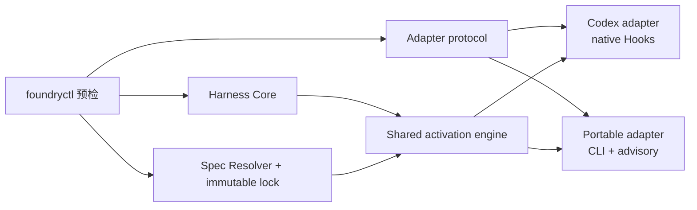
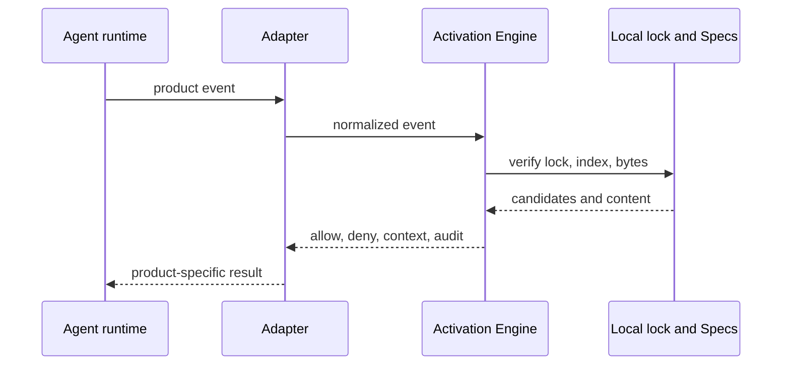

# Agent-neutral Repository Harness Bootstrap

## 目标

`repo-foundry-ai` Bootstrap 把项目共享的工程控制面与具体 Coding Agent 的接入方式
分开：一个 Agent-neutral Core 持有工程文档、Harness manifest、Engineering Spec
lock 与任务激活语义；一个或多个 adapter 负责 instruction discovery、生命周期事件、
上下文注入、写入门禁与信任提示。



Core 不包含产品事件名、产品配置路径、工具 payload 或信任模型。adapter 只能接入
Core 的公开契约，不得复制或改写 Engineering Specifications。

## Bootstrap 与 adapter 选择

查看当前发行版提供的 adapter、版本、enforcement 和能力：

```bash
python3 <repo-foundry-ai-dir>/scripts/foundryctl.py --repo . adapter list
```

Bootstrap 默认 dry-run。明确选择一个或多个 adapter：

```bash
python3 <repo-foundry-ai-dir>/scripts/foundryctl.py --repo . \
  bootstrap --adapter portable

python3 <repo-foundry-ai-dir>/scripts/foundryctl.py --repo . \
  bootstrap --adapter codex --adapter portable \
  --spec languages/go --apply
```

adapter ID 不得重复，生成路径不得发生 ownership collision。现有 schema 3 Harness
可以追加 adapter；删除 adapter 不在 `0.2.0` 范围内，因为删除定制配置需要独立的
所有权和迁移决策。

兼容期内：

- `--profile codex` 等价于 `--adapter codex`，并返回
  `HARNESS_PROFILE_ALIAS_DEPRECATED`；
- 同时传 `--profile` 与 `--adapter` 会失败；
- 两者都省略时暂时默认 `codex`，并返回
  `HARNESS_ADAPTER_DEFAULT_DEPRECATED`；
- schema 1/2 只读兼容，只有显式 `upgrade --to 0.2.0 --apply` 写 schema 3。

## Core 与 adapter 的安装结构

Core 路径由所有 adapter 共享：

```text
ARCHITECTURE.md
docs/
├── .engineering/
│   ├── harness.json
│   ├── specs.json
│   └── specs.lock.json
├── agent-guides/
│   └── managed/
│       ├── index.md
│       └── <locked-spec>.md
├── index.md
├── QUALITY_SCORE.md
├── RELIABILITY.md
├── SECURITY.md
└── design-docs/index.md
.repo-foundry/
└── engineering-specs/spec_router.py
```

Codex adapter 增加：

```text
AGENTS.md
.agents/skills/engineering-specs/
├── SKILL.md
├── agents/openai.yaml
└── scripts/spec_router.py
.codex/hooks.json
```

`.agents/.../scripts/spec_router.py` 是薄翻译器，不包含第二份激活逻辑。它把 Codex
Hook 输入翻译成 Core event，再把 Core decision 翻译回 Codex Hook 输出。

Portable adapter 只增加：

```text
docs/agent-guides/README.md
```

它通过 `begin`、`candidates`、`activate`、`status`、`audit` 显式使用共享引擎，
enforcement 为 CLI/advisory，不声称原生拦截写入。

## 能力与 enforcement

adapter 能力由 `adapter list` 的结构化输出声明：

| 能力 | Codex | Portable |
|---|---|---|
| instructions | file | file |
| skills | file | none |
| lifecycle events | 四类标准化事件 | none |
| context injection | native | advisory |
| mutation gate | native | cli |
| completion audit | native | cli |
| project trust | user review | none |

`native`、`cli`、`advisory` 是验证边界，不可互相冒充。Codex 的 native 声明只覆盖
已注册 Hook 与受支持工具形状；Portable 的 CLI 检查不等于运行时沙箱。

## Harness schema 3

`docs/.engineering/harness.json` 记录独立版本面和每个文件的唯一 owner：

```json
{
  "schema_version": 3,
  "owner": "repo-foundry",
  "producer": {
    "name": "repo-foundry",
    "version": "0.2.0"
  },
  "core": {
    "version": "1.0.0"
  },
  "adapters": [
    {
      "id": "codex",
      "version": "2.0.0",
      "enforcement": "native"
    },
    {
      "id": "portable",
      "version": "1.0.0",
      "enforcement": "cli"
    }
  ],
  "components": ["engineering-execution-plan"],
  "instruction_files": [],
  "files": [],
  "applied_migrations": []
}
```

每个 `files` 记录保留 `path`、`ownership`、`template_id`、
`template_version`、`template_sha256`、`installed_sha256`，并增加
`owner_kind: core|adapter`；adapter 文件另有 `owner_id`。未知未来 schema、Core、
adapter、template、producer 或 migration 版本一律 fail closed。

RepoFoundry distribution、Harness schema、Core、每个 adapter、Spec Activation
protocol 与 Engineering Specifications Catalog 分别版本化。改变 Codex Hook 字节不应
提升 Catalog；改变规范正文也不应提升 Codex adapter。

## 版本与 Harness 升级

当前迁移目标为 `0.2.0`：

```bash
python3 <repo-foundry-ai-dir>/scripts/foundryctl.py --repo . \
  upgrade --to 0.2.0
python3 <repo-foundry-ai-dir>/scripts/foundryctl.py --repo . \
  upgrade --to 0.2.0 --apply
```

迁移默认只预览，并遵循以下证据规则：

- 文件等于当前模板：只登记当前 provenance；
- 文件等于旧记录的 `installed_sha256`：可安全替换；
- 生成文件已修改或来源未知：保留原字节并报告 conflict，要求显式合并；
- 定制的 repository document：保留原字节并清除不可信模板 provenance；
- schema 2 的 Codex profile 映射为 `codex@2.0.0` adapter；
- 安装唯一的 Core activation engine，并在来源可证明时把旧 Router 改成薄 adapter；
- Spec manifest、lock、managed Markdown 与 Catalog 版本不参与 Harness migration；
- 写入后 validation 失败：恢复全部触碰文件并清理本次创建的空目录；
- 重复 apply：不再更新任何字节。

迁移历史分别记录 `harness-schema-v1-to-v3` 或
`harness-schema-v2-to-v3`。普通 Bootstrap 不会静默迁移旧 manifest，也不会在旧
schema 上追加新的 adapter。

## Engineering Specifications

规范正文来自独立 Git Catalog。Bootstrap 安装必选 Spec 和用户通过重复
`--spec <id>` 明确选择的可选 Spec；仓库检测只生成推荐。选择写入
`docs/.engineering/specs.json`，精确 Git revision、Catalog digest、依赖闭包和内容
SHA-256 写入 `specs.lock.json`，本地副本写入
`docs/agent-guides/managed/`。

```bash
python3 <repo-foundry-ai-dir>/scripts/foundryctl.py --repo . spec plan
python3 <repo-foundry-ai-dir>/scripts/foundryctl.py --repo . spec sync --apply
python3 <repo-foundry-ai-dir>/scripts/foundryctl.py --repo . \
  spec update --spec-version 1.2.0 --spec languages/go --apply
python3 <repo-foundry-ai-dir>/scripts/foundryctl.py --repo . spec validate
```

`scripts/spec_manager.py` 只验证 Catalog、selection、lock、dependency、managed
content 与 index。它不读取 `AGENTS.md`、`.codex/hooks.json` 或 OpenAI metadata。
`foundryctl spec validate` 在 schema 3 项目中另外验证共享 activation engine，但不
验证任意 adapter route。

## 标准化任务激活

Core activation protocol version 1 接受四类事件：

```text
session_start
subagent_start
before_mutation
stop
```

event envelope 只包含 RepoFoundry 概念：protocol version、adapter ID、不透明的
session/turn ID、可选 prompt/planned paths，以及中立 tool category。receipt 按
repository、adapter、session、turn 隔离，因此多个 Agent 产品可以并发使用相同 ID
而不覆盖状态。



候选只由 path scope 产生；最终 activation 必须读取每个候选的 `Applicability` 并
结合任务意图。依赖闭包、explicit-none、digest verification、changed-path audit 和
五字段 handoff 对所有 adapter 完全相同。

## 非破坏性与验证

Bootstrap/upgrade 的 action 包括 `create_directory`、`create_file`、`register`、
`preserve`、`update_metadata`、`replace_file`、`update_manifest` 与 `conflict`。
任意 conflict 都阻止 apply。所有 managed path 拒绝 traversal、symlink、文件/目录
类型冲突和重复 owner。

验证入口：

```bash
python3 <repo-foundry-ai-dir>/scripts/foundryctl.py --repo . validate --harness
python3 <repo-foundry-ai-dir>/scripts/foundryctl.py --repo . \
  validate --adapter codex
python3 <repo-foundry-ai-dir>/scripts/foundryctl.py --repo . \
  validate --adapter portable
```

Core 总是验证；未指定 `--adapter` 时验证全部已安装 adapter。指定 adapter 时，只在
Core 之外验证所选 adapter，因此一个 Portable route 的问题不会伪装成 Codex route
问题。Codex `AGENTS.md` 保持 100 个物理行硬上限，bundled template 不超过 80 行。
