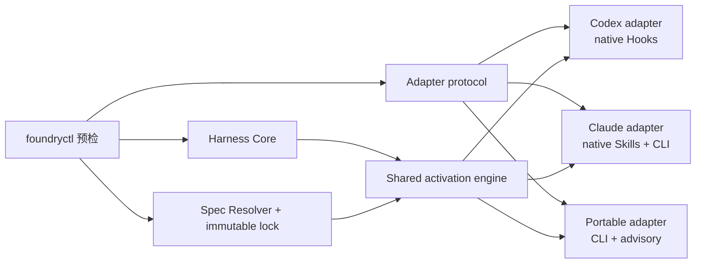
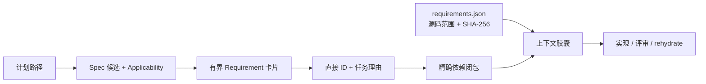

# Agent-neutral Repository Harness Bootstrap

## 目标

`repo-foundry-ai` Bootstrap 把项目共享的工程控制面与具体 Coding Agent 的接入方式
分开：一个 Agent-neutral Core 持有工程文档、Harness manifest、Engineering Spec
lock 与任务激活语义；一个或多个 adapter 负责 instruction discovery、生命周期事件、
上下文注入、写入门禁与信任提示。



Core 不包含产品事件名、产品配置路径、工具 payload 或信任模型。adapter 只能接入
Core 的公开契约，不得复制或改写 Engineering Specifications。

## Bootstrap 与 adapter 选择

查看当前发行版提供的 adapter、版本、enforcement 和能力：

```bash
python3 <repo-foundry-ai-dir>/scripts/foundryctl.py --repo . adapter list
```

Bootstrap 默认 dry-run。明确选择一个或多个 adapter：

```bash
python3 <repo-foundry-ai-dir>/scripts/foundryctl.py --repo . \
  bootstrap --adapter portable

python3 <repo-foundry-ai-dir>/scripts/foundryctl.py --repo . \
  bootstrap --adapter claude

python3 <repo-foundry-ai-dir>/scripts/foundryctl.py --repo . \
  bootstrap --all-adapters \
  --spec languages/go --apply
```

adapter ID 不得重复，生成路径不得发生 ownership collision。现有 schema 3 Harness
可以追加 adapter；删除 adapter 不在当前范围内，因为删除定制配置需要独立的
所有权和迁移决策。

`--all-adapters` 确定性展开为 `codex`、`claude`、`portable`，不能与 `--profile`
或显式 `--adapter` 组合。它不做本机宿主检测，因此不同维护者会生成相同项目状态。

兼容期内：

- `--profile codex` 等价于 `--adapter codex`，并返回
  `HARNESS_PROFILE_ALIAS_DEPRECATED`；
- 同时传 `--profile` 与 `--adapter` 会失败；
- 两者都省略时暂时默认 `codex`，并返回
  `HARNESS_ADAPTER_DEFAULT_DEPRECATED`；
- schema 1/2 只读兼容，只有显式 `upgrade --to 0.8.6 --apply` 写 schema 3。

## Core 与 adapter 的安装结构

Core 路径由所有 adapter 共享：

```text
ARCHITECTURE.md
docs/
├── .engineering/
│   ├── harness.json
│   ├── specs.json
│   └── specs.lock.json
├── agent-guides/
│   └── managed/
│       ├── index.md
│       ├── requirements.json
│       └── <locked-spec>.md
├── index.md
├── QUALITY_SCORE.md
├── RELIABILITY.md
├── SECURITY.md
└── design-docs/index.md
.repo-foundry/
├── engineering-specs/spec_router.py
└── skills/repo-foundry-ai/SKILL.md
```

canonical 项目 Skill 先选择激活深度。普通只读代码解释、导航、调用链追踪和既有行为
总结不启动完整 Harness，也不产生 Spec receipt 或治理制品；正式评审、显式 Spec
合规判断、诊断和仓库修改才按任务范围升级。Codex、Claude 与 Portable 的发现入口
必须保持相同边界，不能因宿主不同而扩大触发范围。

Codex adapter 增加：

```text
AGENTS.md
.agents/skills/repo-foundry-ai/SKILL.md
.agents/skills/engineering-specs/
├── SKILL.md
├── agents/openai.yaml
└── scripts/spec_router.py
.codex/hooks.json
```

`.agents/.../scripts/spec_router.py` 是薄翻译器，不包含第二份激活逻辑。它把 Codex
Hook 输入翻译成 Core event，再把 Core decision 翻译回 Codex Hook 输出。

Claude adapter 增加：

```text
.claude/skills/
├── repo-foundry-ai/SKILL.md
└── engineering-specs/SKILL.md
```

两个文件都是普通、仓库相对的项目 Skill。根入口读取 Core 中的 canonical Skill；
Engineering Specs 入口以 `adapter_id: claude` 调用唯一的 Core Router。当前版本不
创建 `CLAUDE.md` 或 Claude Hooks，enforcement 为 CLI/advisory。

Claude Code 中个人同名 Skill 优先于项目同名 Skill。因此发行包的个人
`repo-foundry-ai` 入口也必须在目标仓库存在 canonical Skill 时读取它；没有个人
注册时，`.claude/skills/repo-foundry-ai/SKILL.md` 直接提供同一发现入口。两条路径
最终都消费同一个仓库版本契约。

Portable adapter 只增加：

```text
docs/agent-guides/README.md
```

它通过 `begin`、`candidates`、`requirements`、`activate`、`rehydrate`、`status`、
`audit` 显式使用共享引擎，
enforcement 为 CLI/advisory，不声称原生拦截写入。

## 能力与 enforcement

adapter 能力由 `adapter list` 的结构化输出声明：

| 能力 | Codex | Claude | Portable |
|---|---|---|---|
| instructions | file | none | file |
| skills | file | native | none |
| lifecycle events | 五类标准化事件 | none | none |
| context injection | native | advisory | advisory |
| mutation gate | native | cli | cli |
| completion audit | native | cli | cli |
| project trust | user review | user review | none |

`native`、`cli`、`advisory` 是验证边界，不可互相冒充。Codex 的 native 声明只覆盖
已注册 Hook 与受支持工具形状；Claude 的 native 只表示 Skill discovery；Claude
与 Portable 的 CLI 检查都不等于运行时沙箱。

## Harness schema 3

`docs/.engineering/harness.json` 记录独立版本面和每个文件的唯一 owner：

```json
{
  "schema_version": 3,
  "owner": "repo-foundry",
  "producer": {
    "name": "repo-foundry",
    "version": "0.8.6"
  },
  "core": {
    "version": "1.5.1"
  },
  "adapters": [
    {
      "id": "codex",
      "version": "2.4.0",
      "enforcement": "native"
    },
    {
      "id": "claude",
      "version": "1.3.0",
      "enforcement": "cli"
    },
    {
      "id": "portable",
      "version": "1.3.0",
      "enforcement": "cli"
    }
  ],
  "components": ["engineering-design", "engineering-execution-plan"],
  "instruction_files": [],
  "files": [],
  "applied_migrations": []
}
```

每个 `files` 记录保留 `path`、`ownership`、`template_id`、
`template_version`、`template_sha256`、`installed_sha256`，并增加
`owner_kind: core|adapter`；adapter 文件另有 `owner_id`。未知未来 schema、Core、
adapter、template、producer 或 migration 版本一律 fail closed。

RepoFoundry distribution、Harness schema、Core、每个 adapter、Spec Activation
protocol 与 Engineering Specifications Catalog 分别版本化。改变 Codex Hook 字节不应
提升 Catalog；改变规范正文也不应提升 Codex adapter。

## 版本与 Harness 升级

当前迁移目标为 `0.8.6`：

```bash
python3 <repo-foundry-ai-dir>/scripts/foundryctl.py --repo . \
  upgrade --to 0.8.6
python3 <repo-foundry-ai-dir>/scripts/foundryctl.py --repo . \
  upgrade --to 0.8.6 --apply
```

0.8.0 引入、并由后续版本保持的 migration 会以 additive 方式创建
`docs/.epctl/decision-views.json`、`docs/DECISION-VIEWS.md` 与
`docs/decision-views/`。preview 必须逐项显示，apply 后 registry 保持空集合；迁移
不得创建领域 View 或修改任何 ADR。目标路径已有 repository-owned 内容时保留原字节，
若内容不满足新契约则失败并回滚本次新建路径，交由 owner 显式协调。

迁移默认只预览，并遵循以下证据规则：

- 文件等于当前模板：只登记当前 provenance；
- 文件等于旧记录的 `installed_sha256`：可安全替换；
- 生成文件已修改或来源未知：保留原字节并报告 conflict，要求显式合并；
- 定制的 repository document：保留原字节并清除不可信模板 provenance；
- schema 2 的 Codex profile 映射为 `codex@2.0.0` adapter；
- 安装唯一的 Core activation engine，并在来源可证明时把旧 Router 改成薄 adapter；
- schema 3 的旧 Core 与 adapter 版本保持可读；升级到 Core `1.5.1`、Codex
  `2.4.0`、Claude/Portable `1.3.0` 时按已记录 provenance 替换生成文件并记录
  组件 migration；
- Spec manifest、lock、managed Markdown 与 Catalog 版本不参与 Harness migration；
- 写入后 validation 失败：恢复全部触碰文件并清理本次创建的空目录；
- 重复 apply：不再更新任何字节。

迁移历史分别记录 `harness-schema-v1-to-v3` 或
`harness-schema-v2-to-v3`。普通 Bootstrap 不会静默迁移旧 manifest，也不会在旧
schema 上追加新的 adapter。

## Engineering Specifications

规范正文来自独立 Git Catalog。Bootstrap 安装必选 Spec 和用户通过重复
`--spec <id>` 明确选择的可选 Spec；仓库检测只生成推荐。选择写入
`docs/.engineering/specs.json`，精确 Git revision、Catalog digest、依赖闭包和内容
SHA-256 写入 `specs.lock.json`，本地副本写入
`docs/agent-guides/managed/`。

```bash
python3 <repo-foundry-ai-dir>/scripts/foundryctl.py --repo . spec plan
python3 <repo-foundry-ai-dir>/scripts/foundryctl.py --repo . spec sync --apply
python3 <repo-foundry-ai-dir>/scripts/foundryctl.py --repo . \
  spec update --spec-version 1.5.0 --spec languages/go --apply
python3 <repo-foundry-ai-dir>/scripts/foundryctl.py --repo . spec validate
```

Catalog 更新后，只要出现尚未配置的可选 Spec，dry-run 就会返回
`selection_decision.status=required`，列出所有 candidate 的 ID、描述、依赖、推荐态
与配置态。CLI 在用户通过完整 `--spec` 集合、`--required-only` 或
`--keep-selection` 明确决策前拒绝 apply；Agent 必须展示候选并询问用户，不得自行
推断“保持原选择”。

`scripts/spec_manager.py` 只验证 Catalog、selection、lock、dependency、managed
content、路由 index 与 `requirements.json`。它不读取 `AGENTS.md`、
`.codex/hooks.json` 或 OpenAI metadata。
`foundryctl spec validate` 在 schema 3 项目中另外验证共享 activation engine，但不
验证任意 adapter route。

## 标准化任务激活

Core activation protocol version 2 接受五类事件：

```text
session_start
subagent_start
context_resume
before_mutation
stop
```

event envelope 只包含 RepoFoundry 概念：protocol version、adapter ID、不透明的
session/turn ID、可选 prompt/planned paths，以及中立 tool category。receipt 按
repository、adapter、session、turn 隔离；内部 `context_epoch` 在新上下文、子 Agent
或 `rehydrate` 时递增，因此 compaction 后能重新注入同一份精确胶囊。



`requirements.json` 是从已锁定 Spec 原字节确定性生成的派生索引。它记录每个
Requirement 的卡片、所属 Spec、精确 UTF-8 字节范围和摘要、上下文依赖、解释框架
范围、Verification 行范围与发布自动执法等级，不复制规范正文。schema v2 还记录
等级来自源码声明还是旧格式的 Advisory 默认值；Router 继续读取 schema v1。
`spec validate` 会重新生成索引并做
逐字节比较，同时再次核验每个范围与摘要。

候选仍只由 path scope 产生；Agent 必须结合任务意图判断 Spec Applicability，再从
16 KiB 卡片预算内选择最小但完整的直接 Requirement 集合。Core 计算闭包，并在
32 KiB 默认预算内按固定顺序拼装：合成身份、强制解释框架、Requirement 原文块、
对应 Verification 行与显式选取的支持章节。任何预算超限都失败，规范原文绝不摘要
或截断；提高默认预算必须用 `--capsule-budget-reason` 记录评审理由。没有正式
Requirement 的旧 Spec、迁移和全库审计可用带理由的 whole-Spec
回退；旧项目缺少派生索引时，Router 也只提供兼容性 whole-Spec 模式，执行一次
`spec sync --apply` 即生成新索引。

协议 v2 receipt 记录适用 Spec、直接/闭包 Requirement ID、逐 ID 理由、源码范围、
发布/有效自动执法等级、胶囊模式、SHA-256、字节数、预算和 epoch。`evidence`
命令会再次复核 receipt 与源码范围，并导出不含规范原文的激活证据。RepoFoundry
没有 finding 判定器，因此有效等级固定为 Advisory，导出明确标记 finding lifecycle
未实现。依赖闭包、explicit-none、digest
verification、changed-path audit 与五字段 handoff 对所有 adapter 完全相同。

## 非破坏性与验证

Bootstrap/upgrade 的 action 包括 `create_directory`、`create_file`、`register`、
`preserve`、`update_metadata`、`replace_file`、`update_manifest` 与 `conflict`。
任意 conflict 都阻止 apply。所有 managed path 拒绝 traversal、symlink、文件/目录
类型冲突和重复 owner。

验证入口：

```bash
python3 <repo-foundry-ai-dir>/scripts/foundryctl.py --repo . validate --harness
python3 <repo-foundry-ai-dir>/scripts/foundryctl.py --repo . \
  validate --adapter codex
python3 <repo-foundry-ai-dir>/scripts/foundryctl.py --repo . \
  validate --adapter claude
python3 <repo-foundry-ai-dir>/scripts/foundryctl.py --repo . \
  validate --adapter portable
```

Core 总是验证；未指定 `--adapter` 时验证全部已安装 adapter。指定 adapter 时，只在
Core 之外验证所选 adapter，因此一个 Claude 或 Portable route 的问题不会伪装成
Codex route 问题。Codex `AGENTS.md` 保持 100 个物理行硬上限；项目 Skill 也由
manifest 记录各自的物理行预算。
