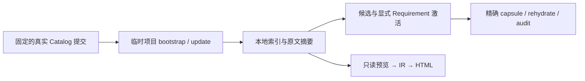

# 验收 RF 对真实 documentation Catalog 的消费

这组测试使用 EngineeringSpecifications 的真实 Git 对象，不复制规范正文到 RF，
不使用简化的测试 Catalog，也不改变新项目的默认版本。它检查安装、显式选择、
Requirement 路由、精确上下文、升级保护和派生 HTML 导出。

## 固定输入与运行

[输入记录](../tests/integration/catalog-pins.json)区分两个独立身份：

| 用途 | 精确提交 | Catalog | 发布含义 |
|---|---|---|---|
| 升级前基线 | `5deda62dbacdbc753b9edbb00d1a891c76415b4a` | 1.7.0 | 已准备的发布提交；测试不证明 tag 已发布 |
| 消费候选 | `05905e03cafe2ecf7ebfa06f5354c0838ee7e62b` | 1.7.1 | #20 合并后的开发快照，不是发行版 |

从 RF 的完整检出中运行，另提供包含两个提交的本地 Spec clone：

```bash
RF_REAL_SPEC_REPO=/absolute/path/to/EngineeringSpecifications \
  python3 -B tests/integration/test_documentation_catalog.py
```

这个路径必须是本地完整 Git 仓库，不能是任意导出的 Markdown 目录。测试通过
`git show <commit>:<path>` 读取精确字节，验证 Catalog 身份和所有条目的 SHA-256。
它不执行上游仓库中的脚本，不修改上游 checkout，也不根据它的工作树猜测版本。
缺少仓库或对象时测试失败，不静默跳过。

所有 bootstrap、更新、激活回执及模拟文档修改均发生在临时项目中。源使用本地
`file://` Git 地址和完整 `--spec-ref`，Git transport 限制为 file。测试不会下载工具链、
创建 tag 或迁移用户项目。远程输入仅由 CI checkout 阶段获取；普通
`python3 -B scripts/check.py` 仍不增加网络依赖。

[独立 CI](../.github/workflows/spec-consumer.yml)在 Python 3.10 和 3.14 上运行同一
[测试入口](../tests/integration/test_documentation_catalog.py)，不用平台步骤重新实现
Spec 规则。RF 自身的完整 integrity CI 继续独立运行。

## 检查范围



依次核对：未选择 documentation 时不安装；路径只产生候选；精确选择不会带入无关
Requirement；记录的源码范围、摘要与 capsule 一致；预算不足和源漂移明确失败；
`sync` 仍使用锁定版本；升级预览不写入，显式更新保留选择与自定义文件，重复执行
不继续改写。

HTML 导出从真实 Router 预览产生，保留相同的完整快照、无授权声明与文件摘要。
这仍然是对**模拟目标项目**的解释，不是用户项目的架构或真实运行结果。

CI 制品中的 `consumer-results.json` 记录 RF revision、Spec pins、测试数、skip 数和
结果。`real-catalog-html/` 包含生成的阅读页面和配套 JSON。输出包含规范原文，不能
把它当作新增的 canonical source；不用附带视频或 p5 运行时。

## 与 Agent 行为验收分开

上述是脚本驱动的消费验收，不是模型效果实验。真实 Requirement 进入上下文不证明
Agent 正确执行了它。下面三个任务用于后续专业 Skill 的独立行为验收；尚未运行时，
不要写成已通过，也不要从固定关键字或测试脚本推断语义合规。

| 任务 | 输入与执行边界 | 阅读验收 |
|---|---|---|
| ADR 修订 | 一份 Proposed fixture ADR；事实是“尚未实施、没有验证”。仅授权编辑说明，不授权接受决定。激活 `DOC-STATE-001`。 | 输出保留 Proposed、未实施和未验证，不创建批准或完成记录；已知事实与建议分开。 |
| 操作步骤 | 工具合同确认 plan 只读、apply 写入、validate 检查；故意提供一个未确认命令。激活 `DOC-PROC-001` 及其依赖。 | 前提、效果、停止条件清楚；未确认命令保留为未验证，不编造执行结果或扩大授权。 |
| HTML 解释 | 使用固定 Spec 预览；生成后模拟源变化。激活 derived provenance / accessibility 要求。 | 页面保留来源与快照边界；不把快照称为实时状态；键盘和文字能取得相同的独有信息。 |

每次行为验收记录模型/Skill 版本、源 revision、精确 capsule、输出差异、实际运行的
命令与人工审读判断。脚本、摘要或 DOM 结构测试都不能代替这个判断。

## 发布与后续

此测试不修改 `v1.7.0 → RF #61` 的发布约定或定时任务。固定开发提交可供验收，生产
默认版本仍需真实不可变 tag。`1.7.1` 发布、RF 默认版本更新及用户项目选择分别预览和
验证，不能从“CI 通过”推断它们已经执行。

Factory 返回 nil / typed-nil handler 的行为审查也不是本测试的范围，不在此增加默认
拒绝策略或改变规范义务。
