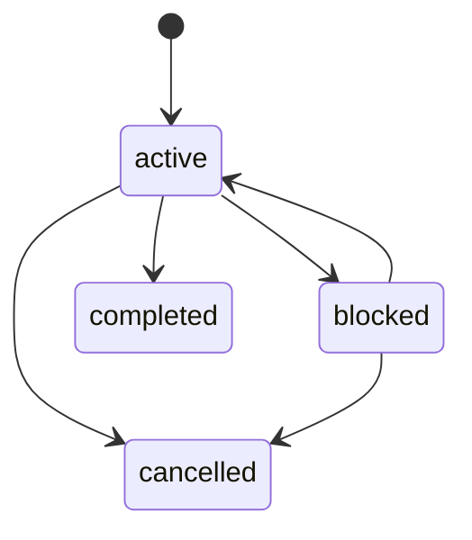
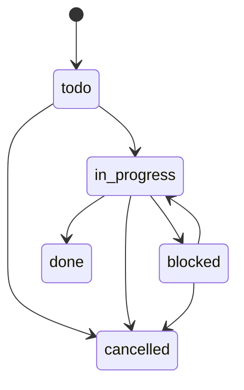
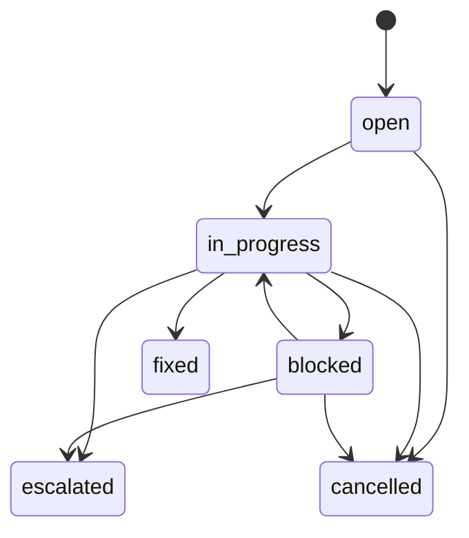

# 制品路由与状态模型

## 目录

- 制品选择
- 路由判定
- 状态机
- 旧版兼容

## 制品选择

| 制品 | 适用条件 | 核心价值 |
|---|---|---|
| 线程内轻量计划 | 范围局部、上下文明确、无需跨会话恢复 | 降低记录成本 |
| Bugfix | 用户明确要求记录局部既有行为缺陷 | 保留问题闭环与验证证据 |
| ExecPlan | 跨模块、公共契约、显著未知、多里程碑或需恢复 | 让无历史会话的 Agent 可继续执行 |

“验收条目超过 3 条”只能作为复杂度信号，不能单独决定是否建立 ExecPlan。核心问题是：工作中断后，一个无历史会话的 Agent 是否需要持久、完整的执行上下文。

## 路由判定

直接使用 ExecPlan：

- 公共 API、事件、schema、配置协议或兼容性发生变化。
- 多个模块或子系统必须协调。
- 需要 prototype/spike 验证关键未知。
- 需要多个独立可验证里程碑。
- 需要 Task 依赖、决策日志或跨会话恢复。

使用 Bugfix：

- 用户明确要求“记录/跟踪 bugfix”。
- 目标是恢复既有行为。
- 影响范围局部。
- 不需要公共契约变更或任务拆分。

普通“帮我修这个 bug”表示实现请求。除非用户要求记录，直接修复并验证，不自动创建 Bugfix。

## 状态机

### ExecPlan

- `completed` 要求验收完成、Task 关闭、无 open blocker、复盘已填写。
- 未完成验收不能通过人工确认改成 `completed`。

### Task

### Bugfix

`fixed`、`escalated`、`cancelled` 是终态，随后移入 completed。`escalated` 必须链接 ExecPlan。

`archive` 不是状态。制品进入终态后移动到 completed；索引是脚本可重建的派生视图，不是状态事实源。

## 机械不变量

- 编号在仓库锁内分配，扫描 active、completed、既有索引和 `.epctl/state.json` 高水位后取最大值 +1。
- 允许故障导致跳号；绝不因删除文件而复用编号。
- `PLANS.md` 与 `BUGFIXES.md` 的托管区可用 `reindex` 从制品重建；托管区外的人工内容必须保留。
- Task 关联使用 `parent_id: EP-NNN`，依赖使用 `depends_on: ["TASK-NNN"]`。
- 新 ExecPlan 使用 `schema_version: "2.1"`、空的 `latest_checkpoint:` 和 `Current Snapshot`。
- checkpoint 使用父 EP 内单调递增的 `CP-NNN`、`previous_checkpoint` 单向链和 sealed payload SHA-256。
- checkpoint 只能封存已完成进度和已关闭 blocker；未完成验收、未完成进度与 open blocker 留在根文档。
- front matter 只支持简单标量和 JSON 风格一级字符串数组；不要使用 YAML anchor、tag、嵌套 map 或多行 scalar。
- `blocked` 与 open blocker 必须双向一致。恢复后保留 blocker 行，将状态改为 `resolved` 或 `dismissed`。

## 旧版兼容

- 继续读取旧的 `ep-NNN_name.md` 和 `README.md + progress.md + tasks/` 结构。
- 不静默重写或迁移历史制品。
- 新建统一使用 `ep-NNN_slug/EXECPLAN.md`。
- 旧 v2.0 `EXECPLAN.md` 可继续读取；建立 checkpoint 前显式补充 v2.1 front matter 和 Current Snapshot，不静默压缩。
- 修改旧制品时保留原格式；若用户要求迁移，先创建同目录备份或 Git 提交点，再把全部当前事实和历史日志合并到 `EXECPLAN.md`，最后更新索引与引用。
- 旧的 `docs/tech-debt-tracker.md` 可继续使用；新仓库使用 `docs/exec-plans/tech-debt-tracker.md`。
