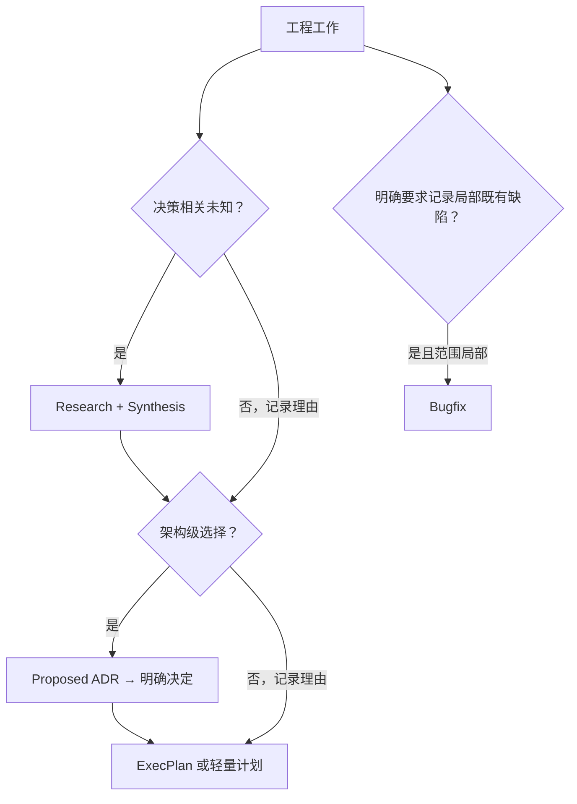
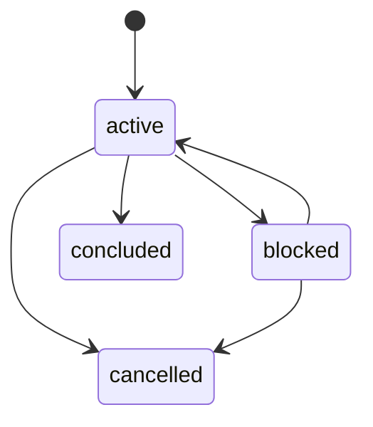
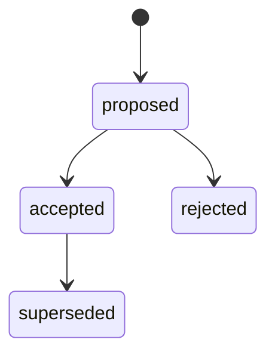
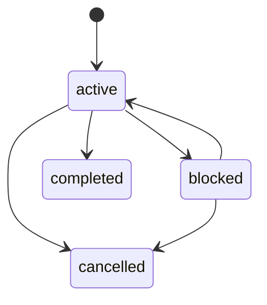
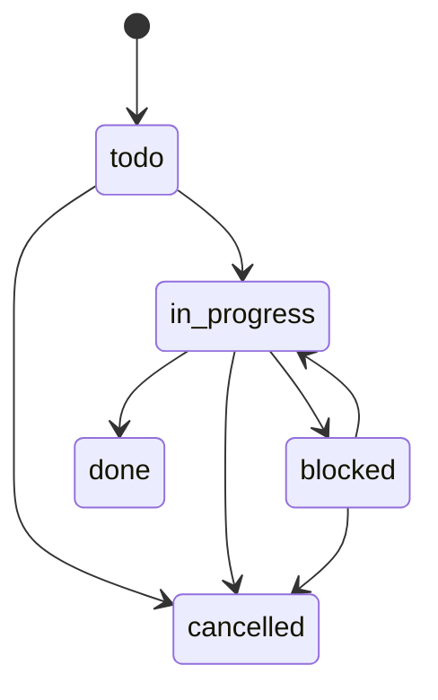
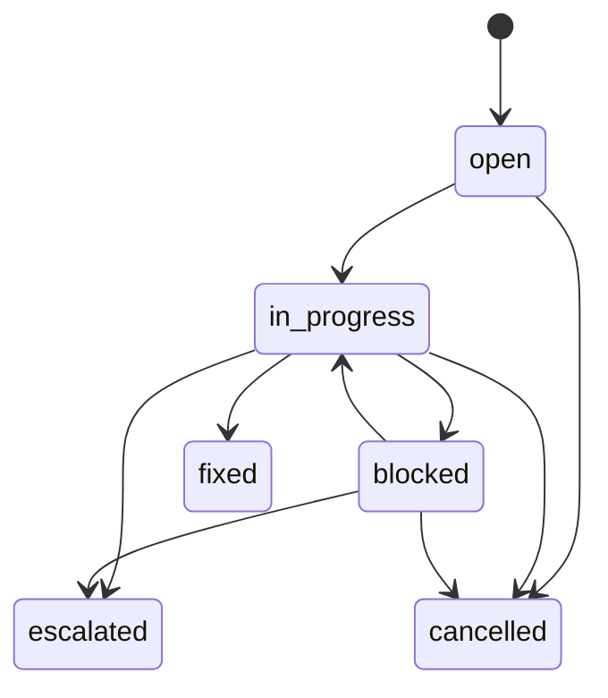

# 制品路由与状态模型

## 制品选择

| 制品 | 适用条件 | 核心价值 |
|---|---|---|
| 线程内轻量计划 | 范围局部、上下文明确、无需恢复 | 降低记录成本 |
| Bugfix | 用户明确要求记录局部既有行为缺陷 | 保存问题闭环和验证证据 |
| Research | 决策相关事实不清，需要比较、实验或外部证据 | 把未知转成可追溯结论 |
| Synthesis | Research 已具备决策输入 | 为 ADR/EP 提供有界结论 |
| ADR | 架构级选择会形成长期约束 | 保存选择、后果和确认方式 |
| ExecPlan | 已知方向需要跨模块、多里程碑或跨会话实施 | 让无历史会话的 Agent 可执行 |

验收项数量只能作为复杂度信号。关键问题依次是：

1. 是否存在会改变路线的未知？
2. 是否存在影响长期边界且逆转成本较高的选择？
3. 工作中断后是否需要持久、完整的执行上下文？

## 路由规则

默认 Research：

- 现有行为、约束或失败边界不清。
- 需要比较库、协议、架构、迁移方案或成本。
- 需要 prototype、spike、benchmark、trace 或真实系统观察。
- 结论涉及公共契约、安全、可靠性、数据或高逆转成本。

可跳过 Research：

- 当前 accepted ADR 和代码事实已覆盖输入。
- 权威标准或用户已固定方案。
- 工作局部、可逆，没有会改变执行路线的未知。

跳过必须在 v2.2 ExecPlan 中记录具体 `research_gate_reason`。

创建 ADR：

- 至少存在两个可信选项；并且
- 影响公共 API/schema/事件/配置、跨系统边界、长期技术约束、迁移成本、安全、数据一致性、可靠性或部署拓扑。

否则在 ExecPlan Decision Log 记录局部取舍，并填写
`architecture_gate_reason`。

使用 Bugfix：

- 用户明确要求持久记录。
- 目标是恢复既有行为。
- 影响局部，不需要 Research、ADR、公共契约变更或任务拆分。

普通“帮我修 bug”直接复现、修复和验证。Bugfix 变复杂后升级为满足 Gate 的 ExecPlan。

## 状态机

### Research

`concluded` 要求没有 open Research Question、open blocker 或 REQUIRED 标记，且 Synthesis 已完整填写。归档命令封存 Synthesis 并移动整个 Research 包。`cancelled` 需要原因，不能满足 Gate。

### ADR

Agent 可以起草 proposed ADR。accepted/rejected 必须记录明确 Decision Owner；正文封存后不可修改。superseded 必须指向更新的 accepted ADR。

### ExecPlan

`completed` 要求验收完成、Task 终态、无 open blocker、复盘完整。

### Task

### Bugfix

`fixed`、`escalated`、`cancelled` 移入 completed；`escalated` 必须链接真实 ExecPlan。

## 机械不变量

- 编号在仓库锁内分配，扫描 active、completed、索引和高水位后取最大值 +1。
- 允许故障跳号；删除文件后也不复用编号。
- `RESEARCH.md`、`DECISIONS.md`、`PLANS.md`、`BUGFIXES.md` 的托管区可由 `reindex` 重建，人工区必须保留。
- 新 ExecPlan 使用 `schema_version: "2.2"`，明确两个 Gate、引用数组和 `Research and Architecture Inputs`。
- Research Gate 只接受 valid + concluded Research；Architecture Gate 只接受 valid + accepted + current ADR。
- Gate 可以为 `not_required`，但必须有理由，且不能同时保留引用。
- ADR 引用的 Research 必须同时进入 ExecPlan。
- sealed Synthesis、decided ADR 和 Checkpoint 使用 Markdown body SHA-256 检测篡改。
- Task 使用 `parent_id: EP-NNN` 和 `depends_on: ["TASK-NNN"]`。
- Checkpoint 只封存已完成进度和已关闭 blocker；开放工作留在根计划。
- Frontmatter 仅支持简单标量和 JSON 风格一级字符串数组。
- `blocked` 与 open blocker 必须双向一致。

`archive` 是物理迁移操作，不是状态。ADR 例外：路径稳定，所有状态都留在 `docs/adr/`。

## 旧版兼容

- 继续读取旧 `ep-NNN_name.md` 和 `README.md + progress.md + tasks/`。
- v2.0/v2.1 `EXECPLAN.md` 保持可读、可验证、可归档；不要静默补 Gate。
- v2.1 仍可 checkpoint。v2.0 建立 checkpoint 前显式迁移到至少 v2.1，并补 `Current Snapshot`。
- 新建统一使用 v2.2 `ep-NNN_slug/EXECPLAN.md`。
- 修改旧制品时保留原格式；用户要求迁移时先建立可恢复点，再合并当前事实与历史。
- 旧 `docs/tech-debt-tracker.md` 继续读取；新仓库使用 `docs/exec-plans/tech-debt-tracker.md`。
